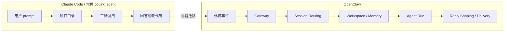

# 00｜给 Claude Code 用户的 OpenClaw 概念迁移表

如果你已经很熟 Claude Code，第一次读 OpenClaw 最容易犯的错是什么？不是把某个命令看错，而是把整套系统继续理解成“在一个项目目录里接收 prompt，然后调用工具完成开发任务”。

这套理解在 Claude Code 里很自然，但放到 OpenClaw 里会偏。OpenClaw 的入口不是单个 CLI prompt，运行对象也不只是一个 repo。它的 README 把自己定义成运行在自己设备上的 personal AI assistant；Architecture 文档进一步说明，长期存在的 Gateway 统一拥有消息渠道、WebSocket 控制面、节点连接和事件推送。也就是说，读 OpenClaw 前需要先换一层心智模型：

> 从“开发任务 agent”切换到“个人 AI 运行时”。

## 这篇先回答什么

- 哪些 Claude Code 心智模型不能直接套到 OpenClaw；
- OpenClaw 里的 session、workspace、memory、heartbeat、cron、delivery 分别改变了什么；
- 后面读 Gateway、Memory、Heartbeat、Cron 时应该带着什么主线。

这篇不展开每个机制的源码细节，只先建立迁移表。

## 先看一张迁移图

这张图先回答一个问题：从 Claude Code 读者视角进入 OpenClaw，应该先把哪几个概念换掉？

读这张图时，建议按这个顺序看：

- 先看 Claude Code 的中心：prompt、项目目录、工具、回答；
- 再看 OpenClaw 的中心：事件、Gateway、会话路由、长期状态、投递；
- 最后看两者差异：OpenClaw 的一次运行结束后，系统状态并没有结束。

<!-- IMAGEGEN_PLACEHOLDER:
title: 00｜Claude Code 到 OpenClaw 的概念迁移图
type: comparison
purpose: 用一张对照图解释哪些 Claude Code 心智模型不能直接套到 OpenClaw
prompt_seed: 生成一张 16:9 中文技术对照图，左侧是 Claude Code/coding agent 的 prompt->repo->tools->answer，右侧是 OpenClaw 的 event->Gateway->Session Routing->Workspace/Memory->Agent Run->Delivery。少字、高对比、技术架构风格，无 logo、无水印。
asset_target: docs/assets/00-concept-migration-imagegen.png
status: pending
-->

## 第一组迁移：从 CLI session 到 routed session

Claude Code 的 session 更接近“我在这个终端、这个项目里继续对话”。它当然也有历史和上下文，但读者通常会把 session 想成一个开发会话。

OpenClaw 的 session 首先来自真实世界的通信关系。Architecture 文档说 Gateway 拥有多个 messaging surfaces，并向客户端、节点和 UI 发出 `agent`、`chat`、`presence`、`health`、`heartbeat`、`cron` 等事件。后面读 Session Routing 时会看到，消息来自哪个渠道、哪个人、哪个群、哪个 agent、哪个 cron/webhook 上下文，都会影响它最终落到哪个运行时会话里。

所以，OpenClaw 的 session 不是“一个终端历史”。它更像一条被路由出来的生活/工作关系线。

## 第二组迁移：从 repo root 到 workspace

Claude Code 读者看到 workspace，容易第一反应是 repo root：源码在哪里、依赖在哪里、测试怎么跑。

OpenClaw 里的 workspace 更接近 agent 的长期生活空间。它不只保存当前开发项目，还要承载身份、规则、长期记忆、heartbeat 检查表、standing orders，以及后续文章会展开的 memory 文件。Automation 文档里说 Standing Orders 通常存在 workspace files 里，并注入到每个 session；Heartbeat 文档也说明 `HEARTBEAT.md` 可以成为周期检查的轻量上下文。

这意味着 workspace 不是“这次任务的目录”，而是“agent 长期运行时状态的一部分”。

## 第三组迁移：从 prompt 到 event source

Claude Code 的直觉是：用户输入 prompt，然后 agent 开始运行。

OpenClaw 仍然能处理用户消息，但用户消息只是事件来源之一。Architecture 文档里 Gateway 会发出 heartbeat、cron 等事件；Automation 文档把 Scheduled Tasks、Heartbeat、Hooks、Standing Orders、Task Flow 放在同一个自动化层里；Cron 文档明确说 Gateway 内置 scheduler 会在时间到达时唤醒 agent。

这改变了一个基本判断：OpenClaw 的 Agent Run 不一定来自人类刚刚发的一句话。它也可能来自周期检查、精确定时、webhook、后台任务完成、节点事件或控制面请求。

## 第四组迁移：从 notification 到 delivery

在 coding agent 里，“通知”通常是结果展示：任务跑完了，告诉用户。

OpenClaw 的 delivery 更像运行时的一部分。它要知道消息从哪个渠道进来、结果要不要回到同一个渠道、是否需要 fallback announce、heartbeat 的 `HEARTBEAT_OK` 是否应该被吞掉、cron 的最终结果是否已经由 agent 主动发送过。后面讲 Reply Shaping 时会展开：模型输出并不直接等于聊天消息，中间还有整形、过滤、去重和投递。

所以，OpenClaw 的输出不是简单打印到终端，而是把 agent 的结果放回真实沟通渠道。

## 一张迁移表

| 旧心智模型 | OpenClaw 里的对应物 | 需要改变的理解 |
|---|---|---|
| CLI session | routed session / agent session | 会话来自渠道、身份、群组、agent、cron/webhook 上下文 |
| repo root | agent workspace | workspace 是长期运行状态，不只是源码目录 |
| CLAUDE.md | AGENTS.md / USER.md / HEARTBEAT.md / MEMORY.md | 规则、身份、周期检查、记忆被拆到不同长期文件 |
| user prompt | event source | 消息、heartbeat、cron、webhook、节点事件都可能触发运行 |
| terminal output | delivery / channel reply | 输出要经过渠道化投递、去重和 fallback |
| compaction | compaction + memory flush | 压缩前重要信息可能被写入长期记忆层 |
| tool permission | runtime boundary | 安全边界从消息进入 Gateway 就开始，而不是只在工具调用时出现 |

## 这篇留下的判断

后面读 OpenClaw，不要先问“它怎么写代码”。更好的问题是：

> 这个系统如何把真实世界里的消息、时间、记忆和投递，组织成一个长期运行的个人 AI runtime？

只要这个问题稳住，Gateway、Memory、Heartbeat、Cron 就不会被误读成普通 coding agent 的功能扩展。
