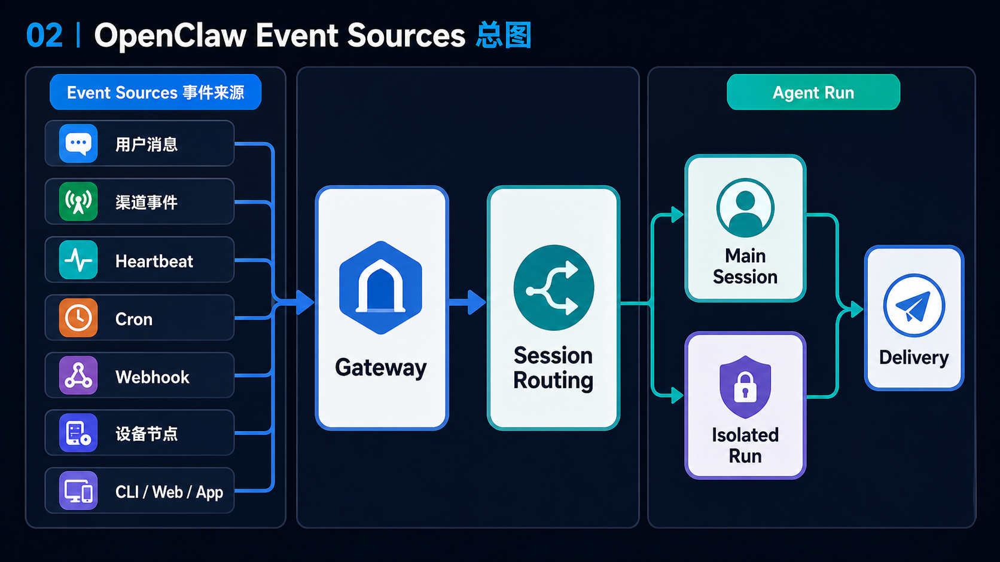

# 02｜Event Sources：OpenClaw 的 Agent Run 从哪里来

读 coding agent 时，我们默认一次运行来自用户 prompt：人说一句，agent 开始做事。这个模型很直观，但在 OpenClaw 里不够用。

OpenClaw 的 Agent Run 可以来自聊天消息，也可以来自 heartbeat tick、cron schedule、webhook、后台任务、节点事件或控制面请求。用户 prompt 只是事件来源之一，不是全部。

> OpenClaw 是 event-driven。理解事件来源，才知道后面的 Gateway、Session Routing、Delivery 为什么要这样设计。

## 这篇先回答什么

- OpenClaw 的 Agent Run 可能从哪些地方来；
- 哪些事件进入主会话，哪些可能进入隔离运行；
- 事件进入 Gateway 后，为什么还要经过 session routing 和 delivery。

## 先看一张事件来源图

这张图先回答一个问题：OpenClaw 的一次 agent run 到底可能由谁触发？

```mermaid
flowchart LR
  subgraph sources["Event Sources"]
    User[用户消息]
    Channel[渠道事件]
    Heartbeat[Heartbeat Tick]
    Cron[Cron Schedule]
    Webhook[Webhook]
    Node[设备 / Node 事件]
    UI[CLI / Web / App 请求]
  end

  GW[Gateway]
  Route[Session Routing]
  Run{Agent Run 类型}
  Main[Main Session Turn]
  Iso[Isolated / Custom Session Run]
  Delivery[Reply Shaping / Delivery]

  User -->

## 源码锚点

- `~/workspace/openclaw/docs/concepts/architecture.md`
- `~/workspace/openclaw/docs/automation/index.md`
- `~/workspace/openclaw/docs/gateway/heartbeat.md`
- `~/workspace/openclaw/docs/automation/cron-jobs.md`
 GW
  Channel --> GW
  Heartbeat --> GW
  Cron --> GW
  Webhook --> GW
  Node --> GW
  UI --> GW
  GW --> Route --> Run
  Run --> Main
  Run --> Iso
  Main --> Delivery
  Iso --> Delivery
```

读这张图时，建议按这个顺序看：

- 左侧先区分事件来源，不要只看用户消息；
- 中间看 Gateway 统一接入，再交给 session routing；
- 右侧看不同 run 类型和最终投递。

<!-- IMAGEGEN_PLACEHOLDER:
title: 02｜OpenClaw Event Sources 总图
type: flow
purpose: 解释 OpenClaw 的 Agent Run 不只来自用户 prompt，而是来自多种真实世界事件
prompt_seed: 生成一张 16:9 中文技术流程图，主题是 OpenClaw Event Sources。左侧包括用户消息、渠道事件、Heartbeat、Cron、Webhook、设备节点、CLI/Web/App；中间是 Gateway 和 Session Routing；右侧是 Main Session、Isolated Run、Delivery。少字、高对比、无 logo、无水印。
asset_target: docs/assets/02-event-sources-imagegen.png
status: generated
-->



## 第一类：人发来的消息

最容易理解的事件来源还是消息。README 列出 OpenClaw 支持 WhatsApp、Telegram、Slack、Discord、Signal、iMessage、Feishu、WeChat 等大量渠道；Architecture 文档也说 Gateway 拥有 messaging surfaces，并维护 provider connections。

这类事件看起来像普通聊天：用户发来一句话，agent 回复。但进入 OpenClaw 后，它不会直接变成模型 prompt。消息要先进入 Gateway，再根据渠道、账号、联系人、群组、agent 配置等信息找到对应 session。这个过程决定了它后面能看到什么 workspace、什么历史、什么权限，以及结果应该投递回哪里。

所以，“用户消息”在 OpenClaw 里已经不是裸 prompt，而是带身份、渠道和路由信息的事件。

## 第二类：Gateway 控制面请求

Architecture 文档里说，macOS app、CLI、web admin 这类 control-plane clients 会通过 WebSocket 连接 Gateway，发送 `health`、`status`、`send`、`agent`、`system-presence` 等请求，并订阅 `tick`、`agent`、`presence`、`shutdown` 等事件。

这说明 OpenClaw 的运行不只来自聊天渠道。控制面也能发起 agent 请求、查看状态、发送消息、观察运行流。对读者来说，这里要注意一个边界：控制面不是“另一个聊天用户”，它更像管理运行时的入口。

后面讲 Control Plane vs Runtime Plane 时会展开：不是所有能力都应该一启动就加载到运行时，但控制面需要能发现、启动、查看和管理这些能力。

## 第三类：Heartbeat Tick

Heartbeat 文档明确说，Heartbeat 是 periodic agent turns in the main session。默认周期可以是 `30m`，也可以按配置改变；它会读取 `HEARTBEAT.md` 或自定义 prompt；如果没事，模型回复 `HEARTBEAT_OK`，OpenClaw 会把它当作确认并可能丢弃。

这类事件的重点不是“定时执行一个任务”，而是让主会话周期性地检查是否有事情需要提醒。Automation 文档也把 Heartbeat 和 Cron 分开：Heartbeat timing 是 approximate，session context 是 full main-session context，并且不会创建 task records。

所以，Heartbeat Tick 触发的是一种低频存在感：有事提醒，没事沉默。

## 第四类：Cron Schedule

Cron 是另一种时间事件，但它和 Heartbeat 不一样。Cron 文档说它运行在 Gateway process 内部，job definitions 持久化到 `~/.openclaw/cron/jobs.json`，runtime state 写到 `jobs-state.json`，所有 cron executions 都创建 background task records。

Cron 的事件来源是精确时间：`--at`、`--every`、cron expression。它可以进入 main session，也可以进入 isolated、current 或 custom session。对读者来说，最要抓住的是：Cron 不是“主会话偶尔醒来顺便看看”，而是明确的调度系统，有任务定义、运行状态、历史记录和投递策略。

这也是后面必须单独写 Cron 篇，而不能把它当 Heartbeat 子功能的原因。

## 第五类：Webhook、Hooks、Background Task 和 Node 事件

Automation 文档把 Hooks、Tasks、Task Flow、Standing Orders 都放进自动化层。Hooks 会响应生命周期事件、session compaction、gateway startup、message flow；Tasks 记录 detached work；Task Flow 管理多步骤流程；节点则通过 Gateway WebSocket 以 `role: node` 连接，暴露 `canvas.*`、`camera.*`、`screen.record`、`location.get` 等命令。

这些事件不一定每次都直接变成一条聊天回复，但它们会影响 OpenClaw 何时运行、运行什么、如何记录、如何投递。尤其是 background task completion 这类事件，会让系统需要在“后台完成”和“前台通知”之间建立桥。

这进一步说明：OpenClaw 不是单入口 agent，而是事件汇聚起来的运行时。

## 事件进入后发生什么

事件来源只是第一步。进入 Gateway 后，OpenClaw 还要回答三个问题：

1. **这是谁的事件？** 也就是渠道、账号、联系人、群组、设备或控制面身份；
2. **它应该进入哪条 session？** 是 main session、某个 routed session、cron isolated session，还是 custom session；
3. **结果应该怎么出去？** 是原渠道回复、fallback announce、webhook、silent，还是只写入 task/run history。

这三个问题分别引出后面的 Gateway、Session Routing 和 Reply Shaping。也正因为事件来源多，OpenClaw 才需要比 CLI coding agent 更完整的运行边界。

## 这篇留下的判断

从这一篇开始，可以把 OpenClaw 的输入改叫 event source，而不是 prompt。这个词背后的重点是：

> OpenClaw 的运行由真实世界事件驱动；用户消息只是其中一种事件。

下一篇进入 Gateway。Gateway 要解决的不是“怎么包一层 API”，而是“这些来源不同、身份不同、投递目标不同的事件，如何先进入一个统一的运行边界”。

## Readability-coach 自检

- 是否回答了读者问题：是，开头先从读者容易带入的旧心智模型进入，再给出本章判断。
- 是否降低术语密度：是，第一次出现的运行时概念都尽量配了中文解释，没有把英文术语当作入口。
- 是否保留源码锚点：是，锚点集中列出，正文只引用必要机制，不做目录游览。
- 是否避免无关项目叙事：是，只使用 Claude Code / coding agent 作为读者迁移背景，没有引入无关项目关系。
