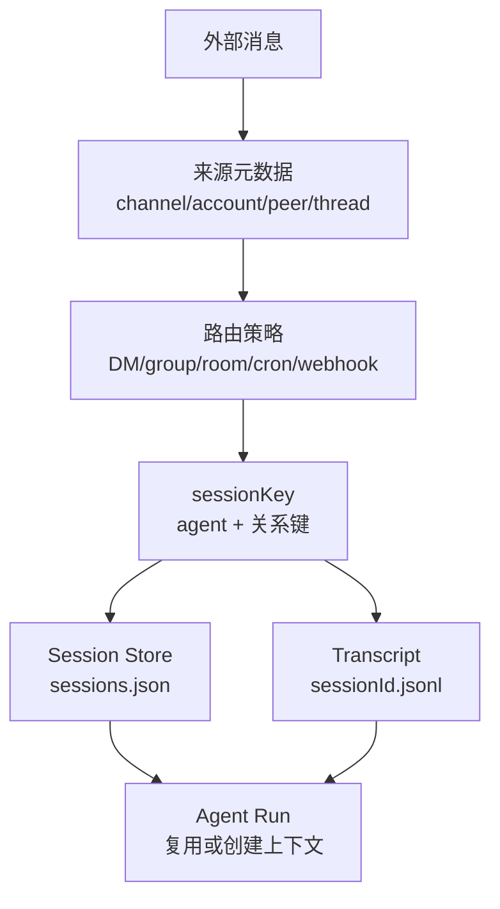
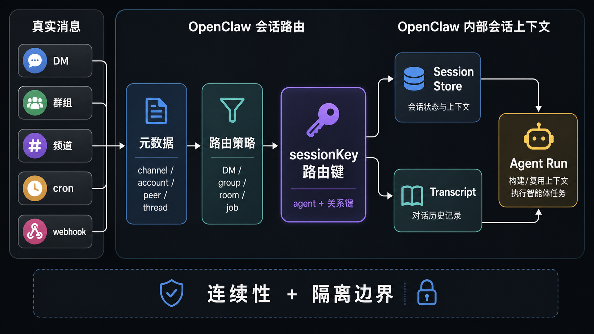

# 04｜Session Routing：真实世界的消息如何变成 Agent 上下文

一条微信、Telegram、Slack 或 webhook 消息进来以后，OpenClaw 不能只问“用户说了什么”。它还要问：这条消息来自哪个渠道？哪个账号？哪个聊天对象？是否在群里？是否属于某个 thread？应该进入哪个 agent？应该复用旧上下文，还是新开一次运行？

这就是 **Session Routing**：把真实世界里的通信关系映射成 OpenClaw 内部的 session。这里的 session 不只是聊天历史 ID，还是一把路由键。它决定这次 agent run 读哪份历史、写到哪个 transcript、继承哪个 workspace 语境，并影响 delivery 最后回到哪里。

## 这篇先回答什么

- OpenClaw 的 session 为什么不是普通 CLI session；
- `sessionKey` 如何把渠道、用户、群组、agentId 等信息编码成运行时上下文；
- 为什么 session routing 同时是连续性机制，也是隔离机制。

这篇不展开 reply shaping，也不展开 memory search；这里只讲“消息进入哪个上下文”。

## 先看一张机制图

这张图回答一个问题：同样是一条消息，OpenClaw 怎么把它变成可执行的 agent 上下文。



读这张图时，建议按这个顺序看：
- 外部消息先被拆成渠道、账号、聊天对象、thread 等元数据；
- 路由策略决定这些元数据如何压成 `sessionKey`；
- `sessionKey` 再指向 session store 和 transcript；
- agent run 不是凭空开始，而是在这条上下文线里继续。

<!-- IMAGEGEN_PLACEHOLDER:
title: Session Routing 路由键
type: flow
purpose: 解释真实世界消息如何被路由成 OpenClaw 内部 session 上下文
prompt_seed: 生成一张 16:9 中文技术流程图，主题是 OpenClaw Session Routing。左侧是真实消息来源：DM、群组、频道、cron、webhook；中间是 channel/account/peer/thread 元数据和 sessionKey；右侧是 session store、transcript、agent run。少字、高对比、无 logo、无水印。
asset_target: docs/assets/04-session-routing-imagegen.png
status: generated
-->



## 源码锚点

- `~/workspace/openclaw/docs/concepts/session.md`：session routing、DM/group/room/cron/webhook 的隔离策略。
- `~/workspace/openclaw/src/routing/session-key.ts`：`sessionKey` 的构造、thread 维度和请求/存储侧标准化。
- `~/workspace/openclaw/src/config/sessions/paths.ts`：session store 与 transcript 路径规则。
- `~/workspace/openclaw/src/gateway/server-session-key.ts`：Gateway 侧 session key 解析与路由入口。


## 第一层：路由策略来自真实通信关系

`docs/concepts/session.md` 先给了一个表：Direct messages 默认共享 session，group chats 按 group 隔离，rooms/channels 按 room 隔离，cron jobs 每次 fresh session，webhooks 按 hook 隔离。

这张表的意义不是配置说明，而是提醒我们：OpenClaw 的 session 从一开始就不是“终端里的一次聊天”。它来自真实通信关系。不同渠道、不同群、不同用户、不同自动化来源，都可能要求不同的连续性和隔离策略。

尤其是 DM。文档明确提醒：默认所有 DM 共享一个 session，适合单用户场景；如果多个人都能给 agent 发消息，就应该启用 `session.dmScope`，比如 `per-channel-peer`，否则不同用户会共享上下文。这不是体验细节，而是安全边界。

## 第二层：`sessionKey` 是外部关系到内部状态的映射

`src/routing/session-key.ts` 是这篇的源码锚点。它定义了几种主要构造：

- `buildAgentMainSessionKey`：构造 `agent:<agentId>:<mainKey>`；
- `buildAgentPeerSessionKey`：根据 channel、accountId、peerKind、peerId、dmScope 构造直接聊天或群组的 session key；
- `resolveThreadSessionKeys`：在 base session key 之后追加 thread 维度；
- `toAgentStoreSessionKey` / `toAgentRequestSessionKey`：在请求侧和存储侧之间做标准化。

这些函数共同说明：`sessionKey` 不是随便起的字符串。它把 agent identity 和外部关系压成一个可存储、可查找、可复用的键。

例如 DM scope 不同，key 的形态也不同：

- `main`：直接回到 agent 的 main session；
- `per-peer`：按发送者隔离；
- `per-channel-peer`：按渠道 + 发送者隔离；
- `per-account-channel-peer`：按账号 + 渠道 + 发送者隔离。

这就是 OpenClaw 的 session routing 会同时影响体验和安全的原因：同一个人跨渠道要不要共享上下文，多个人给同一个 agent 发消息要不要隔离，都在这里落地。

## 第三层：session state 由 Gateway 拥有

`docs/concepts/session.md` 说得很清楚：所有 session state 由 Gateway 拥有，UI clients 向 Gateway 查询 session data。默认路径是：

```text
~/.openclaw/agents/<agentId>/sessions/sessions.json
~/.openclaw/agents/<agentId>/sessions/<sessionId>.jsonl
```

`src/config/sessions/paths.ts` 进一步把路径规则写进源码：session store 位于 `agents/<agentId>/sessions/sessions.json`，transcript 文件放在同一个 agent 的 `sessions/` 目录下，并且对 session id 和路径做安全校验。

这和普通 CLI session 又不一样。CLI 的 session 往往可以理解成“这个终端进程里的上下文”。OpenClaw 的 session 则是 Gateway 管理的运行时状态：控制端可以查询，agent run 可以写入，cron/background task 可以引用，session maintenance 可以清理。

## 第四层：session 生命周期不只看更新时间

OpenClaw 的 session 文档还区分了几个时间字段：

- `sessionStartedAt`：当前 `sessionId` 什么时候开始；
- `lastInteractionAt`：最后一次真实用户/渠道交互；
- `updatedAt`：store row 最近一次变更。

这个区分很重要。Heartbeat、cron、exec 等系统事件可能写 session metadata，但不应该延长 idle reset freshness。也就是说，OpenClaw 不会把“系统自己动了一下”误认为“用户又回来了”。

这也是长期运行 agent 需要守住的边界：自动化可以继续发生，但用户会话的清新度和隔离策略不能被后台事件随便改写。

## 对 Claude Code 读者的迁移点

如果你从 Claude Code 来，可以先把 session 理解成“上下文连续性”。但 OpenClaw 还要多一步：它必须先回答“这条真实世界消息属于哪种关系”。

迁移时不要把 session 简化成聊天记录：

- 它决定读取哪条 transcript；
- 它决定写入哪条 session store；
- 它影响 workspace 和 agent identity；
- 它影响 delivery 的回路；
- 它也是多用户、多渠道、多 agent 场景下的隔离边界。

## 小结

OpenClaw 的 session 不只是聊天历史 ID，还是外部关系、agent identity 和 runtime state 的路由键。

下一篇会继续往下走：session 选好了，OpenClaw 还需要一个长期生活空间来放规则、身份、记忆、heartbeat 清单、会话痕迹和自动化状态。这个空间就是 workspace。

## Readability-coach 自检

- 是否回答了读者问题：是，围绕真实消息如何进入 agent 上下文展开。
- 是否降低术语密度：是，`sessionKey`、session store、transcript 都先用中文解释作用，再展开源码位置。
- 是否保留源码锚点：是，保留 `session-key.ts`、session paths、Gateway session key 相关锚点。
- 是否避免无关项目叙事：是，只用 Claude Code / coding agent 做读者迁移背景。
