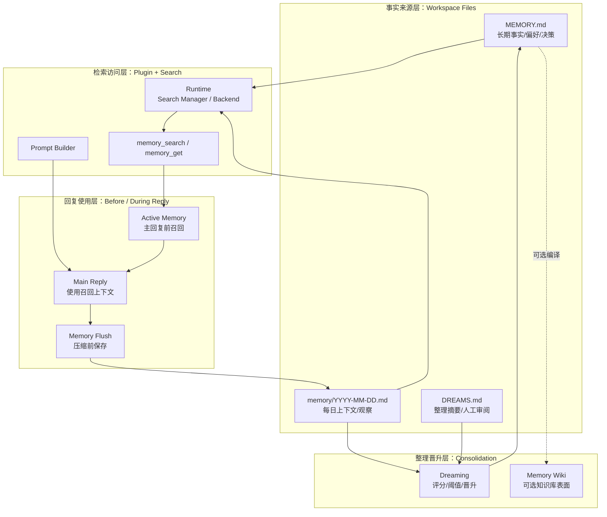

# 06｜Memory 总览：OpenClaw 如何让 Agent 拥有可用记忆

## 读者问题

OpenClaw 的 memory 到底由哪些层组成？

如果你用过 Claude Code，可能已经熟悉两类“记忆”：一类是写在全局或项目配置里的偏好，另一类是对话上下文里的临时摘要。OpenClaw 处理的是更长周期的问题：当一个个人 AI runtime 长期运行在自己的 workspace 里，它怎样把事实保存下来、在需要时找回来、放进回复路径，并在后台继续整理？

本章先不把每个子机制展开成目录游览，而是给第二卷建立一张发布态阅读地图：OpenClaw 的 memory 可以按四层理解——**事实来源层、检索访问层、回复使用层、整理晋升层**。

## 本篇结论

OpenClaw 的 memory 是一套**文件优先、插件托管、可检索、可主动召回、可整理晋升的长期上下文系统**。

它不是“模型内部真的记住了用户”。源码和文档给出的边界更具体：

1. 事实先落到 agent workspace 里的 Markdown 文件；
2. active memory plugin 把这些文件接入 prompt、工具、flush plan 和 runtime capability；
3. `memory_search` / `memory_get` 负责按语义或路径取回记忆；
4. Active Memory 在主回复前给系统一次受限召回机会；
5. Memory Flush 在压缩前给系统一次静默保存机会；
6. Dreaming 在后台把短期信号整理、评分，并只把合格项晋升到 `MEMORY.md`；
7. Memory Wiki 可以作为旁路知识库表面，但不是 memory 的底层机制。

因此，本章会反复强调一个判断：**backend、Memory Wiki、public artifacts 都是扩展或展示面；OpenClaw memory 的主线是文件事实 -> 检索访问 -> 回复使用 -> 整理晋升。**

```text
写入文件 -> 建索引 / 注册能力 -> 回复前召回 -> 压缩前保存 -> 后台整理 -> 再变成可召回的长期事实
```

这正是 OpenClaw 和一次性 prompt-response agent 的差异之一：它把个人 AI 的连续性落到了 workspace 和 plugin runtime 上。OpenClaw 的核心定位也在这里：它不是 Pi，也不是 Claude Code 平替；它更像一个能把个人状态长期运行起来的 AI runtime。

## 源码锚点

本篇建议按下面顺序读：

- `docs/concepts/memory.md`：官方 memory overview，定义 MEMORY.md、daily notes、DREAMS.md、memory tools、flush、dreaming。
- `docs/concepts/memory-search.md`：memory search 的检索、embedding、hybrid search 与调参入口。
- `docs/concepts/active-memory.md`：Active Memory 作为主回复前 blocking memory sub-agent 的运行边界。
- `docs/concepts/dreaming.md`：Dreaming 的 phase、promotion、Dream Diary、threshold 和 review surface。
- `docs/concepts/memory-builtin.md`：默认 SQLite memory backend。
- `docs/concepts/memory-qmd.md`：QMD sidecar backend。
- `docs/concepts/memory-honcho.md`：Honcho memory backend。
- `docs/plugins/memory-wiki.md`：把 durable memory 编译成 provenance-rich wiki vault 的 companion plugin。
- `src/memory/root-memory-files.ts`：根 memory 文件的路径和发现逻辑。
- `src/plugins/memory-state.ts`：memory plugin capability、prompt section、flush plan、runtime、public artifacts 的注册中心。
- `src/plugins/memory-runtime.ts`：core 侧取得 memory runtime capability 的薄封装。
- `src/plugin-sdk/memory-*.ts`：插件 SDK 暴露的 memory host/search/config 能力边界。

## 先看机制图



读这张图时先看四层，而不是数功能点：文件是事实来源，插件和 search 是访问层，Active Memory / Flush 把记忆接进回复生命周期，Dreaming 决定哪些短期材料能晋升成长期事实。Memory Wiki 可以在长期事实成熟后提供知识库化表面，但它不是这条链路的起点。

<!-- IMAGEGEN_PLACEHOLDER:
title: 06｜Memory 总览：OpenClaw 的分层记忆系统
type: memory-map
purpose: 用一张正式中文技术架构图解释 OpenClaw memory 的文件层、插件层、检索层、主动召回层、生命周期层和知识库层
prompt_seed: 生成一张 16:9 中文技术架构图，主题是 OpenClaw Memory Overview。画面分为六层：Workspace Files、Memory Plugin Capability、Memory Search Tools、Active Memory、Memory Flush/Dreaming、Memory Wiki。突出闭环关系：写入、索引、召回、保存、晋升、再召回。高对比、工程化、少量标签、无 logo、无水印。
asset_target: docs/assets/06-memory-overview-imagegen.png
status: generated
-->

<details class="imagegen-figure" markdown="1">
<summary>配图：展开查看 imagegen2 视觉概览</summary>


这张图片适合作为总览，不需要一次记住所有箭头。先抓住三层：workspace 文件是事实落点，memory plugin 是运行时边界，Active Memory / Flush / Dreaming 是读写和整理节奏。下面再逐层拆开。

</details>


## 第一层：事实来源层，记忆先是可见文件

`docs/concepts/memory.md` 开头给了最重要的事实边界：OpenClaw remembers things by writing plain Markdown files in your agent's workspace。模型只“记得”写到磁盘上的内容，没有隐藏状态。

这句话应该放在所有 backend、工具和 UI 之前理解：OpenClaw memory 的事实来源不是模型内部状态，也不是单纯的向量库，而是 agent workspace 里的文件。

核心文件有三类：

| 文件 | 作用 | 阅读时抓住的边界 |
| --- | --- | --- |
| `MEMORY.md` | 长期记忆。保存 durable facts、preferences、decisions。DM session 启动时会加载。 | 已确认值得长期保留的事实。 |
| `memory/YYYY-MM-DD.md` | 每日笔记。保存运行中的上下文、观察、短期材料。今天和昨天会自动加载。 | 近期上下文和候选信号，不等于都该长期保存。 |
| `DREAMS.md` | 可选 Dream Diary / dreaming sweep 输出，供人类审阅。 | 整理过程的可读表面，不是所有晋升的唯一来源。 |

`src/memory/root-memory-files.ts` 也能看到根 memory 文件的源码边界：canonical 文件名是 `MEMORY.md`，同时保留 legacy `memory.md` 的处理和 repair 路径。这说明长期记忆在实现上首先被当作 workspace 文件处理，而不是某个远端人格数据库。

这一层的设计价值是“可审查”。用户可以打开文件看，Agent 可以写，插件可以索引，后台整理也有可回看的输出。对用过 Claude Code 的读者来说，可以把它理解为：OpenClaw 不是只在 prompt 里塞一段固定偏好，而是在 workspace 里维护一组有寿命差异的记忆文件。

## 第二层：检索访问层，文件通过插件和工具变成可用上下文

文件解决的是事实落点，不自动解决“用的时候找得到”。长期运行后，`MEMORY.md`、daily notes 和补充语料都会变多；用户也不一定会用原文关键词发问。因此 OpenClaw 在文件之上放了一层检索访问能力。

对主 Agent 来说，最直接的入口是两个工具：

- `memory_search`：用语义搜索找到相关记忆，即使用词和原文不同也能命中；
- `memory_get`：按文件或行范围读取具体记忆内容。

`docs/concepts/memory.md` 说明，当 embedding provider 配好后，`memory_search` 使用 hybrid search：vector similarity 加 keyword matching。前者负责语义接近，后者负责 ID、代码符号、专有名词这类精确词。这样，memory 才从“归档文件”变成“运行时可取回的上下文”。

这层能力由 active memory plugin 提供，默认是 `memory-core`。源码上，`src/plugins/memory-state.ts` 把 memory 注册成 `MemoryPluginCapability`：

```ts
export type MemoryPluginCapability = {
  promptBuilder?: MemoryPromptSectionBuilder;
  flushPlanResolver?: MemoryFlushPlanResolver;
  runtime?: MemoryPluginRuntime;
  publicArtifacts?: MemoryPluginPublicArtifactsProvider;
};
```

这里不需要把四个字段都展开成独立章节。发布态阅读只要抓住一个结论：OpenClaw core 没有把所有 memory 细节硬编码死，而是通过 capability contract 接收插件提供的 prompt、flush、runtime 和展示能力。`src/plugins/memory-runtime.ts` 进一步提供了 core 侧取得 memory runtime capability 的薄封装。

backend 也属于这一层，但它的权重应该放低。Builtin SQLite、QMD sidecar、Honcho 代表不同检索/存储实现；它们影响“怎么索引、怎么搜、能接哪些语料”，但不改变主线：**文件层是事实来源，search backend 是访问加速层。**

## 第三层：回复使用层，让记忆进入主回复路径

检索工具仍然是被动能力。如果只给 Agent 一个 `memory_search`，它必须先意识到“我应该查一下”。在普通 coding agent 经验里，这就是记忆经常失效的地方：用户没有显式说“你还记得吗”，但项目偏好、历史决定、个人习惯已经应该影响答案。

OpenClaw 在回复路径里放了两次关键机会：一次读，一次写。

```text
用户消息 -> Active Memory 子过程 -> memory_search / memory_get -> 摘要或 NONE -> 主回复
主回复 / 长会话 -> Memory Flush -> 写回 memory files -> 后续可召回
```

第一条是 Active Memory。`docs/concepts/active-memory.md` 把它定义为 plugin-owned blocking memory sub-agent：它在符合条件的 conversational session 中，先于 main reply 运行一次受限的 memory pass。它不替主 Agent 回答，也不应该把原始检索结果直接暴露给用户；它只是给主回复一个隐藏的、有限的相关记忆摘要。

第二条是 Memory Flush。`docs/concepts/memory.md` 说明，在 compaction 总结会话前，OpenClaw 会跑一个 silent turn，提醒 Agent 把重要上下文保存到 memory files。它解决的不是“回复前想起来”，而是“压缩前别丢掉”。

这两者容易混淆，最好用方向区分：

| 机制 | 方向 | 解决的问题 |
| --- | --- | --- |
| Active Memory | 从长期记忆读回当前回复 | 主回复前主动想起相关事实。 |
| Memory Flush | 从当前会话写回长期/近期文件 | 压缩前保存尚未落盘的重要上下文。 |

所以 OpenClaw 的 memory 不只是“Agent 有个 search tool”。它把检索放进回复生命周期：主回复前有一次受限召回，长会话压缩前有一次静默保存。这样，个人 AI runtime 才能在多轮、多天、多项目之间保持连续性。

## 第四层：整理晋升层，让长期记忆保持高信噪比

如果所有短期材料都直接写进 `MEMORY.md`，长期记忆很快会变成噪声。OpenClaw 的整理晋升层解决的是这个问题：哪些 daily notes、召回痕迹和短期信号真的值得成为 durable memory？

`docs/concepts/dreaming.md` 把 Dreaming 定义为 `memory-core` 里的 background memory consolidation system。它默认关闭，需要 opt-in；启用后，`memory-core` 会自动管理一个 recurring cron job，跑完整 dreaming sweep。

Dreaming 有三个协作 phase：

| Phase | 作用 | 是否写入长期记忆 |
| --- | --- | --- |
| Light | 整理和 stage 最近短期材料 | 否 |
| REM | 提取主题和反思信号 | 否 |
| Deep | 评分并晋升 durable candidates | 是，写入 `MEMORY.md` |

Deep phase 不是“看到就记”。它会用 frequency、relevance、query diversity、recency、consolidation、conceptual richness 等信号，并要求候选通过 `minScore`、`minRecallCount`、`minUniqueQueries` 等门槛。Dreaming 的输出还会写到 `DREAMS.md` 或相关 phase report，供人类审阅。

这层体现了 OpenClaw 对长期记忆的克制：daily notes 可以保留细节，但 `MEMORY.md` 应该只接收更稳定、更有用的事实。换句话说，整理晋升层不是为了让系统“多记”，而是为了让它“少而准地长期记”。

Memory Wiki 也可以放在这一层附近理解，但不要把它当作主机制。官方文档明确说，`memory-wiki` 不替代 active memory plugin；active memory plugin 仍然拥有 recall、promotion、dreaming。Memory Wiki 是 beside it 的 provenance-rich knowledge layer：它把 durable memory 编译成更像知识库的 vault，提供 claims、evidence、freshness、dashboard 和 wiki tools。对本章来说，它是成熟记忆的可选展示/维护表面，而不是 memory 闭环的必要步骤。

## 读源码时应该避免的误解

第一，不要把 memory 简化成 `MEMORY.md`。`MEMORY.md` 是长期事实入口，但 OpenClaw 的 memory 还包括 daily notes、search、active recall、flush、dreaming 等运行时和生命周期规则。

第二，不要把 memory 简化成向量库。向量检索只是 access layer。OpenClaw 更强调文件可见性、插件边界和生命周期管理。

第三，不要把 Active Memory 当成 memory 的全部。Active Memory 只是“主回复前召回”这一层，它依赖底层 search，也依赖上游文件和下游 flush / dreaming。

第四，不要把 Dreaming 写成自动乱记。Dreaming 是 opt-in、scheduled、thresholded、reviewable 的后台整理机制，Deep phase 才会写 `MEMORY.md`。

第五，不要把 backend、Memory Wiki、public artifacts 读成主线。它们很重要，但在总览章里属于访问实现、知识库表面或展示管理面；理解 OpenClaw memory 的主线仍然是四层闭环。

## 本章检查点

读完这一章，你应该能：

- 能把 OpenClaw memory 拆成事实来源、检索访问、回复使用、整理晋升四层。
- 能区分 `MEMORY.md`、daily notes、`DREAMS.md`、backend index 和 Memory Wiki 的角色。
- 能解释为什么 OpenClaw memory 不是隐藏模型状态，而是一套文件优先、插件托管的 runtime 能力。
- 能区分 Active Memory 的“回复前读回”和 Memory Flush 的“压缩前写回”。


## Takeaway

OpenClaw 的 memory 不是“模型记住了用户”，它是一个围绕 workspace 文件和 plugin runtime 展开的长期状态系统。

它先把事实写下来，再让系统能搜到、能在回复前主动想起、能在压缩前保存、能在后台整理，并在需要时以知识库表面供人审阅。四层合起来看，OpenClaw 才体现出个人 AI runtime 的核心特征：它不是一次一答的无状态聊天程序，也不是某个 coding agent 的简单替代，而是把个人状态持续落盘、召回和晋升的一套运行时。
