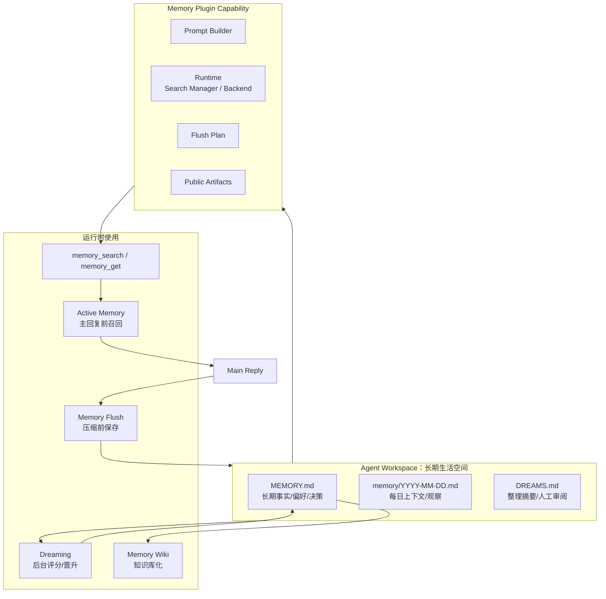
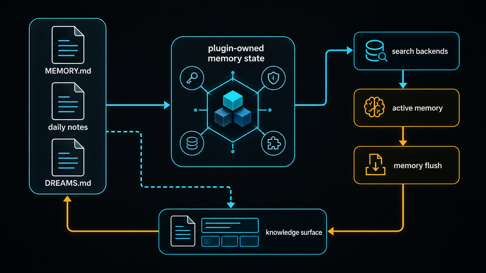

# 06｜Memory 总览：OpenClaw 如何让 Agent 拥有可用记忆

## 读者问题

OpenClaw 的 memory 到底由哪些层组成？

如果从普通 coding agent 的经验出发，很容易把 memory 理解成两种东西：一段塞进 prompt 的用户画像，或者一个向量库工具。OpenClaw 的设计更细：它不把“记忆”藏在模型里，也不满足于给 Agent 一个 search tool；它把长期事实、每日上下文、检索、主动召回、压缩前保存、后台整理、知识库化拆成几层来处理。

本篇先不展开每个子机制，只给第二卷搭一张总地图：OpenClaw 为什么能说自己“有记忆”。

## 本篇结论

OpenClaw 的 memory 是一套**文件优先、插件托管、可检索、可主动召回、可整理晋升的长期上下文系统**。

它关注的不是“模型自己记住了什么”。更准确地说，OpenClaw 把记忆落在这些环节上：

1. 重要事实写到 agent workspace 里的 Markdown 文件；
2. memory plugin 把这些文件和补充语料接成工具、prompt、flush plan 和 runtime capability；
3. `memory_search` / `memory_get` 让 Agent 能按语义或路径取回记忆；
4. Active Memory 在主回复前主动做一次受限召回；
5. Memory Flush 在压缩前给系统一次静默保存机会；
6. Dreaming 在后台把短期信号整理、评分、晋升到 `MEMORY.md`；
7. Memory Wiki 再把 durable memory 编译成更像知识库的 review surface。

因此，OpenClaw 的记忆不是单个功能点，更像一条闭环：

```text
写入文件 -> 建索引 / 注册能力 -> 回复前召回 -> 长会话保存 -> 后台整理 -> 再变成可召回的长期事实
```

这正是 OpenClaw 和一次性 prompt-response agent 的差异之一：它把个人 AI 的连续性落到了 workspace 和 plugin runtime 上。

## 源码锚点

本篇建议按下面顺序读：

- `docs/concepts/memory.md`：官方 memory overview，定义 MEMORY.md、daily notes、DREAMS.md、memory tools、flush、dreaming。
- `docs/concepts/memory-search.md`：memory search 的检索、embedding、hybrid search 与调参入口。
- `docs/concepts/memory-builtin.md`：默认 SQLite memory backend。
- `docs/concepts/memory-qmd.md`：QMD sidecar backend。
- `docs/concepts/memory-honcho.md`：Honcho memory backend。
- `docs/plugins/memory-wiki.md`：把 durable memory 编译成 provenance-rich wiki vault 的 companion plugin。
- `src/memory/root-memory-files.ts`：根 memory 文件的路径和发现逻辑。
- `src/plugins/memory-state.ts`：memory plugin capability、prompt section、flush plan、runtime、public artifacts 的注册中心。
- `src/plugins/memory-runtime.ts`：core 侧取得 memory runtime capability 的薄封装。
- `src/plugin-sdk/memory-*.ts`：插件 SDK 暴露的 memory host/search/config 能力边界。

## 先看机制图



读这张图时先看方向：OpenClaw 不满足于在回复时“读一段记忆”，它把记忆文件、插件能力、检索工具、主动召回、压缩前保存和后台晋升连成闭环。

<!-- IMAGEGEN_PLACEHOLDER:
title: 06｜Memory 总览：OpenClaw 的分层记忆系统
type: memory-map
purpose: 用一张正式中文技术架构图解释 OpenClaw memory 的文件层、插件层、检索层、主动召回层、生命周期层和知识库层
prompt_seed: 生成一张 16:9 中文技术架构图，主题是 OpenClaw Memory Overview。画面分为六层：Workspace Files、Memory Plugin Capability、Memory Search Tools、Active Memory、Memory Flush/Dreaming、Memory Wiki。突出闭环关系：写入、索引、召回、保存、晋升、再召回。高对比、工程化、少量标签、无 logo、无水印。
asset_target: docs/assets/06-memory-overview-imagegen.png
status: generated
-->



这张图片适合作为总览，不需要一次记住所有箭头。先抓住三层：workspace 文件是事实落点，memory plugin 是运行时边界，Active Memory / Flush / Dreaming 是读写和整理节奏。下面再逐层拆开。

## 第一层：文件，不是隐藏模型状态

`docs/concepts/memory.md` 开头就把边界说得很直：OpenClaw remembers things by writing plain Markdown files in your agent's workspace。模型只“记得”写到磁盘上的内容，没有隐藏状态。

这句话定下了边界：OpenClaw 的 memory 首先是可见、可编辑、可审查的文件系统，而不是某个不可解释的模型内部向量。

主要文件有三类：

| 文件 | 作用 |
| --- | --- |
| `MEMORY.md` | 长期记忆。保存 durable facts、preferences、decisions。DM session 启动时会加载。 |
| `memory/YYYY-MM-DD.md` | 每日笔记。保存运行中的上下文、观察、短期材料。今天和昨天会自动加载。 |
| `DREAMS.md` | 可选的 Dream Diary / dreaming sweep 输出。用于人类审阅长期整理过程。 |

这三个文件把“记忆”拆成了不同寿命：

- `MEMORY.md` 是已经确认值得长期保留的事实；
- daily notes 是当天或近期的运行上下文；
- `DREAMS.md` 是后台整理和人工审阅的表面。

这样做的好处是，记忆不会变成一个黑盒。用户、Agent、插件、后台任务都可以围绕这些文件协作。这里也要和上一章的 workspace 区分开：workspace 是长期状态的容器，Memory 是在这个容器里由插件托管的一组文件、工具和生命周期规则。

## 第二层：插件托管，而不是 core 硬编码

OpenClaw 的 memory 不是 core 里写死的一套逻辑。`src/plugins/memory-state.ts` 里可以看到，memory 以 `MemoryPluginCapability` 的形式注册：

```ts
export type MemoryPluginCapability = {
  promptBuilder?: MemoryPromptSectionBuilder;
  flushPlanResolver?: MemoryFlushPlanResolver;
  runtime?: MemoryPluginRuntime;
  publicArtifacts?: MemoryPluginPublicArtifactsProvider;
};
```

这四个字段基本对应四种职责：

- `promptBuilder`：告诉主 Agent 当前有哪些 memory 工具和提示规则；
- `flushPlanResolver`：告诉系统压缩前如何做 memory flush；
- `runtime`：提供 memory search manager、backend config 等运行时能力；
- `publicArtifacts`：把 memory 相关文件作为可展示/可管理的 artifact 暴露出去。

这说明 OpenClaw 的 core 并不直接拥有所有 memory 细节。core 提供注册点和调用边界，具体能力由 active memory plugin（默认 `memory-core`）提供。

这和 OpenClaw 的整体架构一致：core 保持 plugin-agnostic，插件通过 manifest、SDK 和 capability contract 接入。Memory 是 OpenClaw 的基础能力之一，但仍然以插件化方式进入运行时。

## 第三层：检索工具，把文件变成可用上下文

Markdown 文件解决了可见性，还需要解决召回。长期运行后，文件会越来越多，用户也很难每次都准确说出要点词。OpenClaw 因此提供两个工具：

- `memory_search`：用语义搜索找到相关记忆，即使用词和原文不同也能命中；
- `memory_get`：按文件或行范围读取具体记忆内容。

`docs/concepts/memory.md` 还强调，当 embedding provider 配好后，`memory_search` 使用 hybrid search：vector similarity 加 keyword matching。前者负责语义接近，后者负责 ID、代码符号、专有名词这类精确词。

这让 memory 从“文件归档”变成“运行时可召回材料”。

从 backend 看，OpenClaw 也提供了不止一种存储选择：

- Builtin：默认 SQLite backend，开箱可用；
- QMD：local-first sidecar，支持 reranking、query expansion 和索引 workspace 外的目录；
- Honcho：AI-native cross-session memory，有用户建模、语义搜索和 multi-agent awareness。

但无论后端如何变化，读者需要抓住的边界是：**OpenClaw 把 memory 文件作为事实来源，把 search backend 作为检索加速层。** backend 不是记忆的全部，文件层仍然是可审查的根。

## 第四层：Active Memory，让记忆在回复前出现

如果只给 Agent `memory_search` 工具，记忆仍然依赖主 Agent 自己想到“我应该查一下”。这会漏掉很多自然场景：用户没有显式说“你还记得吗”，但相关偏好、项目背景、历史决定其实会影响答案。

Active Memory 解决的是这个问题。它在主回复 prompt 构建前运行一个受限的 blocking memory pass：

```text
用户消息 -> Active Memory 子过程 -> memory_search / memory_get -> 短摘要或 NONE -> 主回复
```

它不是替主 Agent 回答，也不是每次都强行带记忆。它只是在合适的持久聊天会话里，给系统一次“回复前想起来”的机会。

下一篇会专门讲 Active Memory，这里先明确它在总体系里的位置：

- Memory Search 负责“找得到”；
- Active Memory 负责“在主回复前主动找一次”；
- 主 Agent 负责把相关记忆自然融入当前答案。

## 第五层：Memory Flush，把压缩前的丢失风险变成保存机会

长会话一定会遇到上下文膨胀。普通 compaction 会把对话压缩成摘要，但压缩前如果有重要事实还没写入 memory，它们可能在摘要过程中丢失。

OpenClaw 的 Automatic memory flush 就是为了挡这一下。`docs/concepts/memory.md` 说得很清楚：在 compaction 总结会话前，OpenClaw 会跑一个 silent turn，提醒 Agent 把重要上下文保存到 memory files。

这条路径不依赖用户显式说“记住”，它会在长期运行中主动保护上下文连续性。

它和 Active Memory 的方向相反。Active Memory 是“回复前读回来”，Memory Flush 是“压缩前写回去”：

```text
Active Memory：从长期记忆读回当前回复。
Memory Flush：把当前会话沉淀回长期记忆。
```

两者一读一写，是 OpenClaw memory 闭环里最容易混淆、也最需要区分的一对。

## 第六层：Dreaming，把短期信号慢慢晋升为长期事实

Memory Flush 解决的是“压缩前别丢”。Dreaming 解决的是另一个问题：短期材料很多，哪些真的应该进 `MEMORY.md`？

`docs/concepts/dreaming.md` 把 Dreaming 定义为 background memory consolidation system。它默认关闭，需要 opt-in。开启后，`memory-core` 会自动管理一个 recurring cron job，跑完整 dreaming sweep。

Dreaming 有三个协作 phase：

| Phase | 作用 | 是否写入长期记忆 |
| --- | --- | --- |
| Light | 整理和 stage 最近短期材料 | 否 |
| REM | 提取主题和反思信号 | 否 |
| Deep | 评分并晋升 durable candidates | 是，写入 `MEMORY.md` |

Deep phase 不会随便晋升。它要看 frequency、relevance、query diversity、recency、consolidation、conceptual richness 等信号，还要过 `minScore`、`minRecallCount`、`minUniqueQueries` 等门槛。

这说明 OpenClaw 对长期记忆是克制的：不是所有出现过的信息都该进 `MEMORY.md`。Dreaming 把“也许重要”的短期信号放进后台整理流程，让长期记忆保持高信噪比。

## 第七层：Memory Wiki，把 durable memory 变成知识库

如果 `MEMORY.md` 和 daily notes 是原始记忆，那么 Memory Wiki 更像“整理后的知识层”。官方文档说，`memory-wiki` 会把 durable knowledge 编译成 wiki vault，提供：

- deterministic page structure；
- structured claims and evidence；
- contradiction and freshness tracking；
- dashboards；
- compiled digests；
- `wiki_search`、`wiki_get`、`wiki_apply`、`wiki_lint` 等工具。

这里要注意：Memory Wiki 不替代 active memory plugin。文档明确说：active memory plugin 仍然拥有 recall、promotion、dreaming；`memory-wiki` 是 beside it 的 provenance-rich knowledge layer。

也就是说，Memory Wiki 是长期记忆成熟后的“知识库化”表面，而不是最底层的记忆机制。

## 读源码时应该避免的误解

第一，不要把 memory 简化成 `MEMORY.md`。`MEMORY.md` 承载长期事实，但 OpenClaw 的 memory 还包括 daily notes、search、active recall、flush、dreaming、wiki 等多层。

第二，不要把 memory 简化成向量库。向量检索只是 access layer。OpenClaw 更强调文件可见性、插件边界和生命周期管理。

第三，不要把 Active Memory 当成 memory 的全部。Active Memory 只是“主回复前召回”这一层，它依赖底层 search，也依赖上游的文件和下游的 flush/dreaming。

第四，不要把 Dreaming 写成自动乱记。Dreaming 是 opt-in、scheduled、thresholded、reviewable 的后台整理机制，Deep phase 才会写 `MEMORY.md`。

## Readability-coach 自检

- **一句话问题是否回答了？**
  是。本文把 OpenClaw memory 拆成文件层、插件能力层、检索层、主动召回层、生命周期层、知识库层。

- **有没有变成目录游览？**
  没有。文件和源码锚点只服务于一个问题：OpenClaw 如何把“记忆”做成长期运行时能力。

- **有没有保持 OpenClaw 自身叙事？**
  有。没有引入无关项目，也没有把 OpenClaw 写成其他 coding agent 的平替。

- **有没有给后两篇留下坡度？**
  有。下一篇进入 Active Memory，后一篇进入 Memory Flush 与 Dreaming。

## Takeaway

OpenClaw 的 memory 不是“模型记住了用户”，它是一个围绕 workspace 文件和 plugin runtime 展开的长期状态系统。

它先把事实写下来，再让系统能搜到、能在回复前主动想起、能在压缩前保存、能在后台整理、能在人类可审阅的知识库里沉淀。只有把这些层合起来看，才能理解 OpenClaw 为什么更像一个个人 AI 运行时，而不是一轮一轮无状态的聊天程序。
