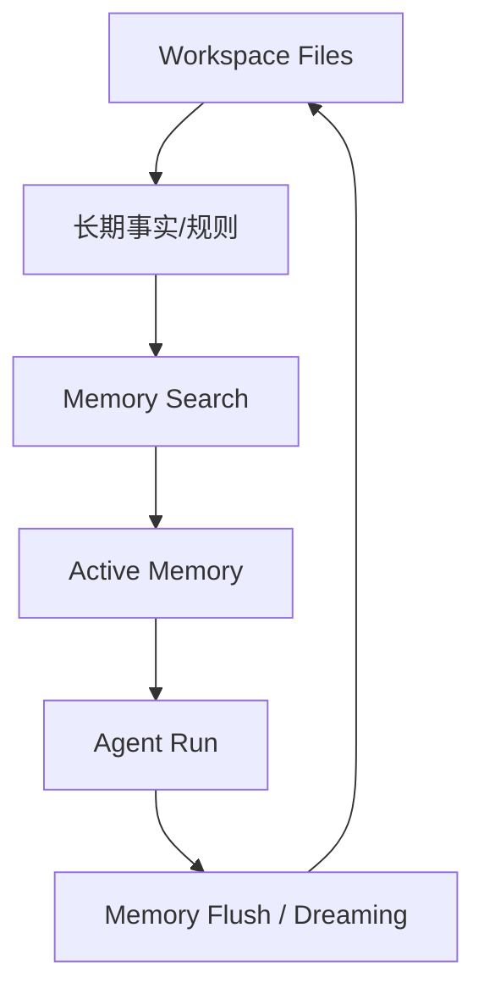

# 07｜Active Memory：为什么记忆不应该总靠主 Agent 自己想起来

> 本篇状态：章节卡片 / 正文待写。后续写作必须先重新阅读下方源码锚点，再展开机制判断。

## 读者问题

为什么 OpenClaw 要在主回复前加一层 blocking memory pass？

## 本篇先给的结论

待正文写作时补充。结论必须回到这条主线：OpenClaw 不是只等用户输入的 coding agent，而是由 Gateway、Session、Workspace、Memory、Heartbeat、Cron、Delivery 等机制组合起来的个人 AI 运行时。

## 先看一张机制图

这张图先作为本篇的低分辨率机制草图，后续正文写作时需要根据源码锚点细化。

读这张图时，先按这个顺序看：
- 先看本篇讨论的入口或触发条件；
- 再看它进入 OpenClaw 运行时之后由哪一层接住；
- 最后看它如何影响长期状态、Agent Run 或真实渠道投递。

<!-- IMAGEGEN_PLACEHOLDER:
title: 07｜Active Memory：为什么记忆不应该总靠主 Agent 自己想起来 机制图
type: memory-map
purpose: 用一张正式技术架构图解释“为什么 OpenClaw 要在主回复前加一层 blocking memory pass？”
prompt_seed: 生成一张 16:9 中文技术架构图，主题是 OpenClaw 源码阅读第 07 篇：Active Memory：为什么记忆不应该总靠主 Agent 自己想起来。图中只保留少量标签，突出层次、边界和主链路；高对比、无 logo、无水印，不要装饰性插画。
asset_target: docs/assets/07-active-memory-imagegen.png
status: pending
-->

## 源码锚点

- `~/workspace/openclaw/docs/concepts/active-memory.md`
- `~/workspace/openclaw/src/plugins/memory-runtime.ts`
- `~/workspace/openclaw/src/auto-reply/reply/agent-runner-memory.ts`

## 写作边界

- 不引入无关项目叙事。
- 不写成 Claude Code 平替；Claude Code 只作为读者迁移背景。
- 不做目录游览；要回答读者问题。
- 术语第一次出现时要用中文说人话。

## 正文大纲草案

1. 从读者问题进入；
2. 先给本篇结论；
3. 对照普通 coding agent / Claude Code 心智模型的失效点；
4. 按源码锚点解释 3-5 个机制层；
5. 区分相邻机制边界；
6. 留下一个能接住下一篇的 takeaway。
