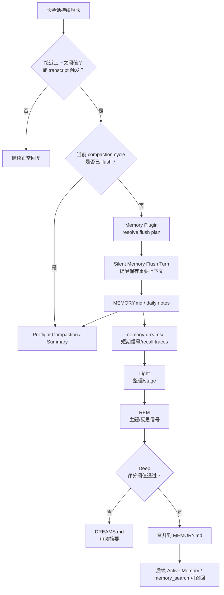
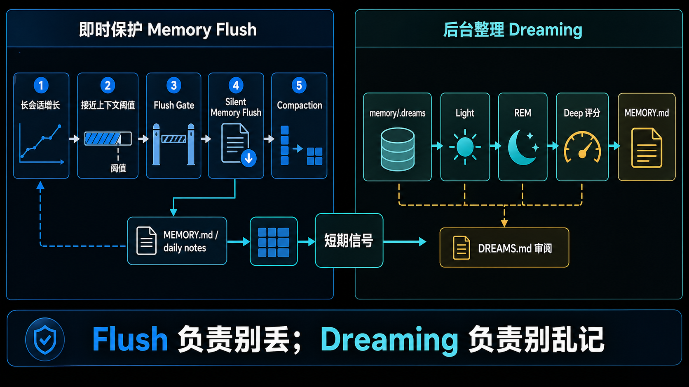

# 08｜Memory Flush 与 Dreaming：OpenClaw 如何防止上下文在压缩时丢失

## 读者问题

长对话压缩前，OpenClaw 如何避免重要信息消失？

这是所有长期 Agent 都绕不开的问题：上下文窗口有限，session 越跑越长，系统迟早要压缩、摘要、截断。普通做法是把历史对话压成一段 summary。但 summary 有一个风险：它会保留“看起来重要”的任务线索，却可能丢掉那些以后才会变重要的用户偏好、项目决定、长期事实。

OpenClaw 没有只依赖 compaction summary。它在 compaction 前后加了两类 memory lifecycle 机制：

- **Memory Flush**：压缩前的静默保存机会；
- **Dreaming**：后台整理、评分、晋升短期信号的慢机制。

本篇就讲这两个机制为什么必须和 Active Memory 分开。

## 本篇结论

OpenClaw 把“上下文快塞满了”这件事，拆成两个不同问题：

1. 当前长会话里有没有还没写入 memory 的重要事实？
   这由 Memory Flush 处理。它在 compaction 前触发一次 silent turn，让 Agent 把值得保存的内容写进 memory files。

2. 短期材料里哪些真的应该长期保留？
   这由 Dreaming 处理。它在后台收集短期信号，经过 Light / REM / Deep phase，把通过阈值的候选晋升到 `MEMORY.md`，并把过程写进 `DREAMS.md` 供审阅。

所以，OpenClaw 的长期记忆不是“压缩时顺手总结一下”。它有一条更清晰的生命周期：

```text
对话产生信号 -> flush 防止压缩前丢失 -> dreaming 后台整理和评分 -> MEMORY.md 长期保留 -> Active Memory 再召回
```

## 源码锚点

- `docs/concepts/memory.md`：Automatic memory flush、Dreaming、grounded backfill 的官方说明。
- `docs/concepts/dreaming.md`：Dreaming 的 phase model、Dream Diary、ranking signals、scheduling、CLI。
- `src/auto-reply/reply/memory-flush.ts`：flush / preflight compaction 的 token gate、重复 flush 去重、context hash。
- `src/auto-reply/reply/agent-runner-memory.ts`：reply runner 中 memory flush 与 compaction 如何接入。
- `src/plugins/memory-state.ts`：MemoryFlushPlan 与 flushPlanResolver 的 plugin capability contract。
- `src/commands/doctor-cron-dreaming-payload-migration.ts`：dreaming 与 cron/job payload 演进相关的诊断迁移入口。

## 先看机制图



这张图要抓住两个节奏：Flush 是压缩前的即时保护；Dreaming 是后台慢整理。一个防止丢，一个控制长期记忆质量。

<!-- IMAGEGEN_PLACEHOLDER:
title: 08｜Memory Flush 与 Dreaming：压缩前保存与后台晋升
type: lifecycle-diagram
purpose: 用一张正式中文技术架构图解释 OpenClaw 如何在长会话压缩前保存重要上下文，并通过 Dreaming 把短期信号晋升为长期记忆
prompt_seed: 生成一张 16:9 中文技术架构图，主题是 OpenClaw Memory Flush and Dreaming。左侧展示长会话接近上下文阈值、flush gate、silent memory flush、compaction；右侧展示 memory/.dreams、Light、REM、Deep、DREAMS.md、MEMORY.md 晋升。突出“即时保护”和“后台整理”两个节奏。高对比、工程化、少量标签、无 logo、无水印。
asset_target: docs/assets/08-memory-flush-dreaming-imagegen.png
status: generated
-->



读图时可以把左半边当成“快路径”，右半边当成“慢路径”：Flush 贴着 compaction，目标是别丢；Dreaming 脱离当前回复，目标是别乱记。这个节奏差异是本章的主线。

## 为什么 compaction summary 不够

Compaction summary 的目标是让当前会话继续跑下去。它会尽量保留任务状态、约束、已经做过的事情、下一步。但 memory 的目标不完全一样。

Memory 要回答的是：哪些事实以后还值得反复使用？

这两者会重叠，但不等价。比如：

- 用户临时让你改一个文件，这对当前任务重要，但未必值得长期记；
- 用户纠正一个偏好，这对当前任务也许只是顺手一句，但未来还会用到；
- 项目里形成一个稳定约定，summary 可能压得很短，但 memory 应该保留得更明确。

所以，如果只靠 compaction，长期记忆会被“当前任务推进”绑架。OpenClaw 用 Memory Flush 在压缩前单独问一次：有没有该写进 memory files 的东西？

## Memory Flush：压缩前的静默保存机会

`docs/concepts/memory.md` 说 Automatic memory flush 默认开启：在 compaction 总结对话前，OpenClaw 会跑一个 silent turn，提醒 Agent 把重要上下文保存到 memory files。

`src/plugins/memory-state.ts` 中的 `MemoryFlushPlan` 说明，flush 不是随便拼一段 prompt；它的计划来自 memory plugin capability：

```ts
export type MemoryFlushPlan = {
  softThresholdTokens: number;
  forceFlushTranscriptBytes: number;
  reserveTokensFloor: number;
  prompt: string;
  systemPrompt: string;
  relativePath: string;
};
```

这几个字段告诉我们：flush 有触发阈值、有 reserve tokens、有具体 prompt、有目标相对路径。也就是说，它是 memory plugin 拥有的一段生命周期策略，而不是 core 硬编码的一次“保存一下”。

## Flush gate：什么时候该跑

`src/auto-reply/reply/memory-flush.ts` 里最值得先读的是 `shouldRunMemoryFlush`。

它会拿当前 session 的 token 状态、context window、reserve floor、soft threshold 计算一个 threshold：

```text
threshold = contextWindow - reserveTokensFloor - softThresholdTokens
```

只有 total tokens 接近或超过这个 threshold，才有必要跑 flush。否则每轮都 flush 会产生噪声，也会把短期材料过早写进长期文件。

同一个文件里还有 `shouldRunPreflightCompaction`。它和 flush gate 使用相近的阈值判断，但目的不同：一个判断是否先保存 memory，一个判断是否需要在正式运行前压缩上下文。

这体现了 OpenClaw 的节奏控制：先判断上下文压力，再决定是否做保存，再进入 compaction 或继续执行。

## 去重：同一轮 compaction 不要反复 flush

Memory Flush 还有一个很实际的问题：如果上下文已经很长，系统可能连续多次触发接近阈值的判断。没有去重，就会反复让 Agent 写相似 memory，最后 `MEMORY.md` 变成重复条目。

源码里有两层防护：

第一层是 `hasAlreadyFlushedForCurrentCompaction`。它比较 `compactionCount` 和 `memoryFlushCompactionCount`，确保当前 compaction cycle 已经 flush 过就不再重复跑。

第二层是 `computeContextHash`。它取 session transcript 尾部最近 3 条 user/assistant 消息，加上 messages length，做 SHA-256 并截断成 16 位。这个 hash 用来判断上下文尾部是否真的变化。若没有变化，再 flush 往往只会产生重复内容。

这两个细节说明 Memory Flush 不是“宁可多写一点”的粗暴逻辑。它知道长期记忆最怕污染，所以要控制重复写入。

## Dreaming：比 flush 更慢的后台整理

Flush 解决的是“压缩前别丢”。但被 flush 或 daily notes 捕获下来的材料，不一定都应该马上进 `MEMORY.md`。

这就是 Dreaming 的位置。`docs/concepts/dreaming.md` 把它定义为 background memory consolidation system in `memory-core`。它默认关闭，需要 opt-in。开启后，`memory-core` 会自动管理一个 recurring cron job，默认频率是：

```text
0 3 * * *
```

也就是每天凌晨三点跑完整 dreaming sweep。

Dreaming 的输出分两类：

- machine state：`memory/.dreams/`，包括 recall store、phase signals、ingestion checkpoints、locks；
- human-readable output：`DREAMS.md` 或 `dreams.md`，以及可选的 phase report 文件。

长期晋升仍然只写 `MEMORY.md`。

这种分离让职责更清楚：机器可以积累候选、信号、检查点；人类可以在 `DREAMS.md` 看见发生了什么；长期事实只由 Deep phase 严格晋升。

## Light / REM / Deep：三种睡眠不是三个按钮

Dreaming 有三个 cooperative phases：

| Phase | 目的 | 是否写长期记忆 |
| --- | --- | --- |
| Light | 摄取最近 daily memory、recall traces、redacted transcript，去重并 stage candidate lines | 否 |
| REM | 从短期 traces 中提取主题、反思和 recurring ideas | 否 |
| Deep | 对候选打分，通过阈值后晋升 durable memory | 是，写 `MEMORY.md` |

文档特别提醒：这些 phase 是 internal implementation details，不是用户配置的三个模式。

从写书角度看，最值得强调的是：OpenClaw 把“短期出现过”与“长期应该记住”隔开了。Light 和 REM 可以记录信号、强化线索，但不会直接污染 `MEMORY.md`。只有 Deep 会写长期记忆。

## Deep ranking：为什么它不直接全记住

Deep phase 的 ranking signals 包括：

- Frequency：短期信号出现频率；
- Relevance：检索质量；
- Query diversity：不同查询或日期上下文中的出现多样性；
- Recency：时间衰减后的新鲜度；
- Consolidation：跨天重复强度；
- Conceptual richness：snippet/path 的概念密度。

它还要求候选通过 `minScore`、`minRecallCount`、`minUniqueQueries` 等门槛。

这说明 Dreaming 追求的不是“尽可能多记”，它更在意长期记忆的高信噪比。对个人 AI runtime 来说，丢掉一些低价值短期碎片，比把所有东西都塞进 `MEMORY.md` 更健康。

## Dream Diary：给人看的审阅表面

Dreaming 还会维护 `DREAMS.md` 里的 narrative Dream Diary。文档说，memory-core 会在每个 phase 有足够材料后，跑一个 best-effort background subagent turn，追加简短 diary entry。

但这个 diary 不是 promotion source。Dreaming-generated diary/report artifacts 会被排除在 short-term promotion 之外，只有 grounded memory snippets 才有资格晋升到 `MEMORY.md`。

这个边界要写清楚：`DREAMS.md` 是审阅表面，不是事实来源本身。它让用户知道系统在整理什么、为什么整理，但不会让“系统自己的反思文本”直接循环变成长期事实。

## Grounded backfill：历史材料也要可回放、可回滚

`docs/concepts/memory.md` 还提到 grounded backfill：它可以读取历史 `memory/YYYY-MM-DD.md` notes，生成结构化 review output 写入 `DREAMS.md`，也可以把 grounded durable candidates stage 到 short-term dreaming store。

这里的边界是：grounded backfill 不直接提升到 `MEMORY.md`。如果使用：

```bash
openclaw memory rem-backfill --path ./memory --stage-short-term
```

候选会进入和 normal deep phase 相同的 short-term store。之后仍然由 Deep phase 判断是否晋升。

同时，它有 rollback 命令，可以撤销 staged artifacts。这说明 OpenClaw 对历史回放也保持可审查、可撤销，而不是把旧笔记一股脑导入长期记忆。

## 与 Active Memory 的闭环关系

现在可以把 06-08 三篇连起来看：

```text
06 Memory Overview：记忆系统有哪些层。
07 Active Memory：回复前如何主动读回相关记忆。
08 Flush / Dreaming：长会话和后台如何把经历沉淀成长期记忆。
```

Active Memory 是读路径，Memory Flush / Dreaming 是写入和整理路径。更细一点说，Flush 仍然贴近当前会话和 compaction，Dreaming 则是后台生命周期；它们都服务长期记忆，但不在主回复前替模型“想起”内容。缺任何一边，OpenClaw 的 memory 都不完整。

如果只有 Active Memory，没有 Flush / Dreaming，系统只能召回已经存在的记忆，新的长期事实容易在压缩中丢失。

如果只有 Flush / Dreaming，没有 Active Memory，系统可能确实保存了很多东西，但主回复不一定能在第一时间自然用上。

OpenClaw 把两边接起来，才形成个人 AI runtime 的连续性。

## Readability-coach 自检

- **一句话问题是否回答了？**
  是。OpenClaw 通过 Memory Flush 在压缩前保存重要上下文，通过 Dreaming 在后台整理并晋升短期信号。

- **有没有把 Heartbeat / Cron 混进来讲乱？**
  没有。只在 Dreaming scheduling 处说明它由 memory-core 管理 recurring cron job，没有把 Dreaming 写成 Cron 本身。

- **有没有把 Dreaming 写成自动乱记？**
  没有。文中强调 opt-in、scheduled、thresholded、reviewable，且只有 Deep phase 写 `MEMORY.md`。

- **有没有和 Active Memory 区分清楚？**
  有。Active Memory 是回复前读，Flush / Dreaming 是压缩前写与后台整理。

- **有没有避免无关项目叙事？**
  有。全文只围绕 OpenClaw memory lifecycle 展开。

## Takeaway

Memory Flush 和 Dreaming 共同解决一个长期 Agent 的根问题：上下文会满，短期材料会堆积，但长期记忆不能靠一次 summary 草率决定。

OpenClaw 的答案是把节奏拆开：快要压缩时，先给系统一次静默保存机会；日常运行后，再用 Dreaming 慢慢整理、评分、晋升。这样，记忆既不会在 compaction 中悄悄消失，也不会因为“什么都记”而污染长期事实。

一句话概括：

**Memory Flush 负责别丢，Dreaming 负责别乱记。**
