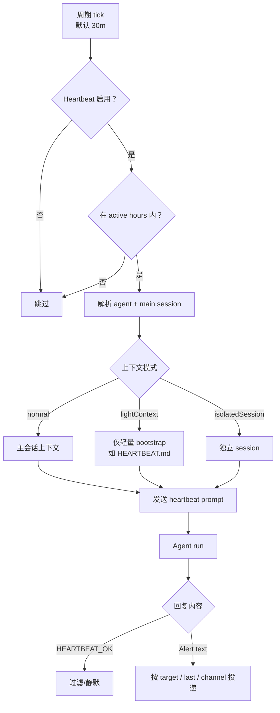

# 09｜Heartbeat：为什么 OpenClaw 会在没有用户输入时醒来

## 读者问题

Heartbeat 解决什么问题？

普通 coding agent 通常只有一种启动方式：用户发来 prompt，Agent 读上下文、调用工具，再返回结果。没有用户输入，就没有 agent run。

OpenClaw 面向的是长期在线的个人 AI 运行时。它要响应用户，也要在合适的时候自己醒来，看看有没有需要提醒、跟进或汇报的事；同时，它不能每次醒来都打扰用户。所以 Heartbeat 处理的不只是“定时跑任务”。它更关心的是：**怎样让 Agent 保持低频存在感，并且在没事时安静下来。**

## 本篇结论

Heartbeat 是 OpenClaw 的**周期性主会话 turn**。它让 Agent 在没有用户输入时也能进入一次主 session，读取 `HEARTBEAT.md` 或配置里的 prompt，检查待关注事项；如果没有需要提醒的内容，就回复 `HEARTBEAT_OK`，系统会把这条回复过滤掉，不打扰用户。

它不是 Cron，也不是 background task：

- Heartbeat 使用主会话语境，适合“周期检查 / 轻量提醒 / 聚合多个检查项”；
- Cron 追求精确调度和独立执行，适合“每天 9 点发报告 / 20 分钟后提醒 / 每周深度分析”；
- Heartbeat run 本身不创建 background task 记录，Cron execution 会创建。

因此，Heartbeat 的产品价值在于：**给个人 AI 一个克制的醒来机制：没事就沉默，有事才出现。**

## 源码锚点

- `docs/gateway/heartbeat.md`：Heartbeat 的定义、配置、`HEARTBEAT_OK` contract、active hours、delivery、light context、isolated session。
- `docs/automation/index.md`：Heartbeat 与 Cron / Tasks / Hooks / Standing Orders 的决策边界。
- `src/infra/heartbeat-runner.ts`：Heartbeat runner 主体，负责 agent 解析、调度、session、delivery、active hours、system event 等。
- `src/infra/heartbeat-schedule.ts`：heartbeat phase / next due 计算。
- `src/infra/heartbeat-active-hours.ts`：active hours 判断。
- `src/infra/heartbeat-wake.ts`：即时唤醒与 heartbeat wake handler。
- `src/auto-reply/heartbeat.ts`：heartbeat prompt、tasks block、`HEARTBEAT_OK` token 处理。
- `src/auto-reply/heartbeat-filter.ts`：从历史消息中过滤 heartbeat prompt + ack pair，避免污染上下文。
- `src/agents/heartbeat-system-prompt.ts`：heartbeat run 的系统提示片段。

## 先看机制图



这张图想说明的不是“有个定时器”。从 tick 到静默或投递之间，还有一连串边界：启用状态、active hours、session、上下文模式、ack 过滤和 delivery target。

<!-- IMAGEGEN_PLACEHOLDER:
title: 09｜Heartbeat：低频存在感与静默唤醒机制
type: lifecycle-diagram
purpose: 用一张正式中文技术架构图解释 OpenClaw Heartbeat 如何在没有用户输入时唤醒主会话、检查事项，并用 HEARTBEAT_OK 保持安静
prompt_seed: 生成一张 16:9 中文技术架构图，主题是 OpenClaw Heartbeat。左侧是周期 tick、active hours、agent/session 解析；中间是 HEARTBEAT.md / prompt / main session run；右侧是 HEARTBEAT_OK 静默过滤、alert delivery。突出“没事沉默，有事提醒”。高对比、工程化、少量标签、无 logo、无水印。
asset_target: docs/assets/09-heartbeat-imagegen.png
status: pending
-->

## Heartbeat 不是 Cron-lite

最容易误解的地方，是把 Heartbeat 当成“简化版 Cron”。这样会把两者都讲偏。

`docs/gateway/heartbeat.md` 直接说：Heartbeat runs periodic agent turns in the main session。也就是周期性的主会话 turn。它的默认 prompt 也不是“执行某个任务”。它会要求 Agent 读取 `HEARTBEAT.md`，遵守其中清单；不要从旧聊天里推断或重复任务；如果没事，回复 `HEARTBEAT_OK`。

这说明 Heartbeat 更像“检查状态”，不是“精确完成一个 job”。它适合：

- 定期看看 inbox / calendar / reminders 里有没有需要提醒的内容；
- 检查长期关注事项是否有变化；
- 用低频方式把重要信息浮现给用户；
- 批量处理多个轻量检查项，避免每个检查都单独建任务。

Cron 走的是精确时间轴：`at`、`every`、cron expression、timezone、delivery、isolated execution。下一篇会展开。

## `HEARTBEAT.md`：周期醒来时读什么

Heartbeat 可以直接使用配置里的 prompt，也可以依赖 workspace 里的 `HEARTBEAT.md`。这和前面讲的 Workspace Files 是同一条思路：OpenClaw 把长期运行规则拆到不同文件里，`HEARTBEAT.md` 专门承载“周期醒来时要看什么”。

这样能避开一个常见问题：如果把周期检查事项混在普通 `AGENTS.md` 或会话历史里，Agent 每轮普通回复也会看到 heartbeat-only instructions，正常对话就容易被污染。OpenClaw 文档明确说，当 heartbeat 用 `0m` 禁用时，正常 runs 会从 bootstrap context 中省略 `HEARTBEAT.md`。

也就是说，`HEARTBEAT.md` 是一种场景化记忆：只在系统醒来检查时有意义，不应该长期压在每次用户对话里。

## `HEARTBEAT_OK`：让“没事”真的不打扰

Heartbeat 最需要注意的产品细节是 `HEARTBEAT_OK`。

文档定义了明确 contract：

- 没有什么需要注意时，回复 `HEARTBEAT_OK`；
- heartbeat run 中，如果 `HEARTBEAT_OK` 出现在回复开头或结尾，系统会把它当作 ack；
- 去掉 token 后，如果剩余内容不超过 `ackMaxChars`，默认 300 字符，整条回复会被丢弃；
- 如果是 alert，不要包含 `HEARTBEAT_OK`，直接返回提醒文本。

`src/auto-reply/heartbeat-filter.ts` 里还有一个上下文卫生细节：`filterHeartbeatPairs` 会识别 heartbeat user message 和 assistant 的 OK response，并把这对消息从历史里过滤掉。否则每 30 分钟一次的“检查/没事”，很快就会挤占主会话上下文。

这就是 Heartbeat 的克制：系统确实醒来了；没事时，它不会留下可见噪音，也尽量不把空检查塞进后续上下文。

## Active hours：不是 24 小时都该提醒

Heartbeat 还有 active hours。文档里的例子是设置 `activeHours: { start, end, timezone }`，窗口之外的 heartbeat 会跳过，直到下一个窗口内 tick。

这看起来只是一个配置项，但对个人 AI runtime 很重要。Heartbeat 不是单纯的任务调度器，它带有“关注”和“提醒”的含义。半夜把用户叫醒，和白天提醒用户看一眼待办，产品感完全不同。

所以 OpenClaw 把时间也纳入运行边界：同样的周期检查，换个时间段，可能就应该保持沉默。

## lightContext 与 isolatedSession：控制成本和历史污染

Heartbeat 默认使用主会话上下文，因此适合做 context-aware 的周期检查。但如果每半小时都带完整历史，成本会很高，也可能让旧任务反复被误读。

文档提供了两个控制手段：

- `lightContext: true`：只注入轻量 bootstrap context，比如 `HEARTBEAT.md`；
- `isolatedSession: true`：每次 heartbeat 使用 fresh session，不带 prior conversation history。

这两个选项说明，OpenClaw 没有把 Heartbeat 设计成“无限复读主会话”。它可以按任务类型选择上下文重量：日常陪伴可以用主 session，纯检查清单可以用 light context，成本敏感或污染风险高时可以用 isolated session。

## Delivery：醒来之后要不要送到真实渠道

Heartbeat 的 target 默认是 `none`，也就是可以运行，但不对外投递。也可以设为 `last`，送到最近联系的渠道；或者显式指定 channel、recipient、accountId。

这体现了 OpenClaw 和 CLI agent 的差异。CLI agent 打印输出就够了；OpenClaw 的 heartbeat 结果可能要进入真实世界渠道，因此必须知道：送到哪里、是否允许 DM、是否包含 reasoning、是否启用 typing indicator、是否有多账号 channel。

所以 Heartbeat 还连着 delivery runtime，不只是调度问题。

## 与下一篇 Cron 的边界

可以用一句话区分：

```text
Heartbeat：周期性看看有没有事，没事就沉默。
Cron：到点执行一个明确 job，并留下 task/run/delivery 记录。
```

Heartbeat 适合“检查和提醒”；Cron 适合“任务和承诺”。

## Readability-coach 自检

- **一句话问题是否回答了？** 是。Heartbeat 解决的是没有用户输入时的低频醒来、检查、静默或提醒。
- **有没有把 Heartbeat 写成 Cron-lite？** 没有。文中明确它是主会话 periodic turn，不创建 task records。
- **有没有解释静默机制？** 有。解释了 `HEARTBEAT_OK`、ackMaxChars 和 heartbeat pair filtering。
- **有没有保持 OpenClaw 自身叙事？** 有。围绕 Gateway、workspace、session、delivery 的长期运行时展开。

## Takeaway

Heartbeat 让 OpenClaw 从“只等用户输入”变成“会定期醒来看看”。它成熟的地方不只是会醒来，还在于知道何时克制：有事提醒，没事静默；需要上下文时用主 session，成本敏感时用 light/isolated context；该投递时进入真实渠道，不该打扰时保持安静。
