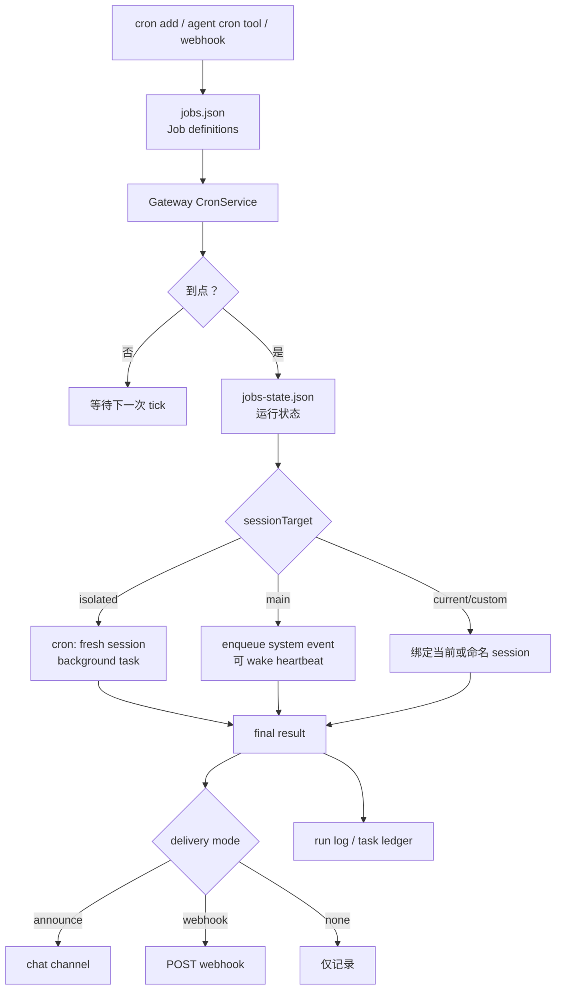

# 10｜Cron：精确调度、隔离执行与结果投递

## 读者问题

Cron 和 Heartbeat 的边界是什么？

上一篇讲 Heartbeat：周期性醒来看看有没有事情，没事就用 `HEARTBEAT_OK` 静默。Cron 走的是另一条时间轴：它关心的不是“看看”，而是“到点执行一个明确 job”。

这篇要回答的是：OpenClaw 为什么需要内建 Cron，而不是让用户自己在系统 crontab 里写脚本。

## 本篇结论

OpenClaw 的 Cron 是 Gateway 内建 scheduler。它负责持久化 job definition，在正确时间唤醒 Agent，选择 main / isolated / current / custom session，记录 background task，并把结果投递到 chat channel 或 webhook。

它和 Heartbeat 的边界可以压成一句话：

```text
Heartbeat 是低频存在感；Cron 是精确承诺。
```

Heartbeat 适合周期检查：有没有新邮件、日程、提醒、异常状态。Cron 适合明确任务：20 分钟后提醒我、每天 9 点发报告、每周一跑深度分析、收到 webhook 后触发某个流程。

## 源码锚点

- `docs/automation/cron-jobs.md`：Cron 的官方概念页，覆盖 schedule types、execution styles、delivery、webhooks、troubleshooting。
- `docs/automation/index.md`：Cron 与 Heartbeat / Tasks / Hooks / Standing Orders 的决策表。
- `src/gateway/server-cron.ts`：Gateway 侧 CronService 构建、wake、webhook、delivery、isolated run 接入。
- `src/cron/service.ts`：`CronService` 对 add/list/update/run/wake 等操作的封装。
- `src/cron/store.ts`：job definitions 与 runtime state 的存储路径和读写。
- `src/cron/isolated-agent/run.ts`：isolated cron agent turn。
- `src/cron/isolated-agent/session.ts`：cron session 解析。
- `src/cron/delivery.ts`：announce / webhook / none delivery plan。
- `src/cron/run-log.ts`：cron run log。
- `src/agents/tools/cron-tool.ts`：Agent 可用的 cron tool schema 与 gateway tool 调用。

## 先看机制图



这张图里有三个要点：Cron 运行在 Gateway，不在模型里；job definition 和 runtime state 分开保存；执行结果不会简单打印，而会进入 delivery 和 task/run log。

<!-- IMAGEGEN_PLACEHOLDER:
title: 10｜Cron：Gateway 内建调度、隔离执行与结果投递
type: runtime-flow
purpose: 用一张正式中文技术架构图解释 OpenClaw Cron 如何持久化任务、到点唤醒、选择 session 执行，并通过 announce/webhook/none 投递结果
prompt_seed: 生成一张 16:9 中文技术架构图，主题是 OpenClaw Cron。画面包含 jobs.json、jobs-state.json、Gateway CronService、main/isolated/current/custom session、background task、delivery modes、run log。突出“精确调度”和“结果投递”。高对比、工程化、少量标签、无 logo、无水印。
asset_target: docs/assets/10-cron-imagegen.png
status: pending
-->

## Cron 为什么必须在 Gateway 里

如果只是“定时执行命令”，操作系统 crontab 当然能做。但 OpenClaw 的 Cron 要调度的不是 shell 命令，它调度的是个人 AI runtime 里的 agent work。

这会带来一个结果它必须知道：

- 当前有哪些 agent；
- job 应该进入哪个 session；
- 是否要创建 isolated run；
- 是否要继承当前聊天的 delivery target；
- 如何记录 background task；
- 如何在失败时通知；
- 如何避免重复投递或 stale interim reply。

这些信息都在 Gateway / session / delivery / task runtime 里。外部 cron 很难安全、完整地拿到。因此 OpenClaw 把 Cron 做成 Gateway 内建 scheduler。

`docs/automation/cron-jobs.md` 也明确说：Cron runs inside the Gateway process, not inside the model。

## jobs.json 与 jobs-state.json：定义和运行态分开

Cron 有两个持久化文件：

- `~/.openclaw/cron/jobs.json`：job definitions；
- `~/.openclaw/cron/jobs-state.json`：runtime execution state。

这个拆分很重要。job definition 是“用户想让系统长期做什么”，可以考虑纳入版本管理；runtime state 是“系统已经跑到哪里、上次执行是什么状态”，不应该和定义混在一起。

文档也提醒：如果你用 git 跟踪 cron definitions，应该 track `jobs.json`，gitignore `jobs-state.json`。

这和前面 Memory 的设计相通：OpenClaw 很重视把 durable intent 和 runtime state 分开。

## 三种 schedule：at / every / cron

OpenClaw Cron 支持三种时间表达：

| Kind | 适合什么 |
| --- | --- |
| `at` | 一次性时间点，比如 20 分钟后提醒、某个 ISO timestamp |
| `every` | 固定间隔，比如每 2 小时检查一次 |
| `cron` | cron expression，适合每天 9 点、每周一 6 点这类日历型调度 |

这里有两个细节需要注意。

第一，没有 timezone 的 timestamp 会按 UTC 处理；本地墙钟时间应该用 `--tz`。

第二，top-of-hour recurring expressions 会自动 stagger，避免很多任务同一秒集中冲击系统。需要精确触发时用 `--exact`。

这说明 OpenClaw 的 Cron 不是裸 croner 包装。它在长期运行场景里处理了负载、时区和精确性之间的取舍。

## 四种 execution style：main / isolated / current / custom

Cron 更有意思的地方在 execution style。

| Style | 含义 | 适合什么 |
| --- | --- | --- |
| Main session | enqueue system event，必要时 wake heartbeat | reminders、系统事件、需要主会话感知的轻任务 |
| Isolated | dedicated `cron:<jobId>` fresh session | 报告、后台 chore、深度分析 |
| Current session | 创建时绑定当前 session | 与当前对话上下文强相关的 recurring work |
| Custom session | 持久命名 session | 需要跨多次 run 积累历史的流程 |

Main session job 更像“把一个事件放进主会话时间线”。Isolated job 则是“另开一个专用执行空间”。这也是 Cron 和 Heartbeat 的重要差异：Cron 可以明确选择执行空间，而 Heartbeat 默认是周期性主会话 turn。

文档还强调：所有 cron executions 都会创建 background task records。这样一来，Cron 就不再是黑盒定时器，而是一项可审计的后台工作。

## Isolated run：为什么 fresh session 很重要

很多定时任务不应该继承当前聊天的环境。比如“每天早上汇总 overnight updates”，它需要稳定、可重复、低污染的执行条件，而不是带上昨晚用户随口聊的内容。

Isolated cron 的语义就是 fresh session。它可能携带安全偏好、模型选择、显式 override，但不会继承旧 cron row 的 ambient conversation context：channel/group routing、send/queue policy、elevation、origin、ACP runtime binding 等都不应该乱带。

这让 Cron 能承载更严肃的后台工作。对 OpenClaw 来说，隔离不是附加安全项，而是自动化可靠性的基础条件。

## Delivery：结果不只存在日志里

Cron 的输出有三种 delivery mode：

| Mode | 作用 |
| --- | --- |
| `announce` | 如果 Agent 没有主动发送，就 fallback deliver final text 到目标渠道 |
| `webhook` | POST finished event payload 到 URL |
| `none` | 不做 runner fallback delivery |

这个设计体现了 OpenClaw 的渠道属性。一个定时 job 的结果可能要发到 Telegram、Slack、Discord、Matrix，也可能 POST 到外部系统，或者只留在 run log 中。

对 isolated jobs，文档还提到一个细节：如果 Agent 已经用 message tool 发到了配置或当前目标，OpenClaw 会跳过 fallback announce，避免重复投递。

## 与 Heartbeat 的边界

可以从五个维度区分：

| 维度 | Cron | Heartbeat |
| --- | --- | --- |
| 时间 | 精确，支持 `at` / `every` / cron expression | 近似周期，默认 30m |
| 语义 | 到点执行 job | 醒来检查有没有事 |
| session | main / isolated / current / custom | 默认主会话，可 light/isolated |
| task record | 总是创建 | 不创建 |
| delivery | announce / webhook / none | inline / target / last / none，且有 `HEARTBEAT_OK` 静默 |

如果一句话必须在某个时刻发生，用 Cron。如果只是希望系统定期看看有没有需要你知道的东西，用 Heartbeat。

## Agent 为什么也需要 cron tool

`src/agents/tools/cron-tool.ts` 说明 Cron 不只是 CLI 功能，Agent 也能通过 tool 创建、更新、运行、删除 cron jobs。

这对个人 AI runtime 很重要。用户可以理解为“明天 9 点提醒我”或“每周一早上给我一份总结”，Agent 不应该只回答“好的”，还应该把这个承诺落成 Gateway scheduler 里的持久 job。

工具 schema 里显式暴露了 schedule、payload、delivery、sessionTarget、failureAlert 等字段，说明 Agent 创建 cron job 时必须把“时间、执行方式、输出方式、失败处理”都结构化下来。

## Readability-coach 自检

- **一句话问题是否回答了？** 是。Cron 是精确调度和承诺执行，Heartbeat 是周期醒来和低频检查。
- **有没有把 Cron 写成系统 crontab？** 没有。文中强调它运行在 Gateway，并连接 session、task、delivery。
- **有没有说明隔离执行？** 有。解释了 main / isolated / current / custom session。
- **有没有说明结果投递？** 有。解释了 announce / webhook / none 和去重投递。
- **有没有避免无关项目叙事？** 有。

## Takeaway

Cron 让 OpenClaw 可以把用户的时间承诺变成持久、可审计、可投递的运行时对象。

它不是“定时叫醒模型”，而是 Gateway 管理的一整条链：job definition、runtime state、session target、background task、agent run、delivery、run log。理解这条链，才能理解为什么 OpenClaw 的自动化不是外部脚本，而是个人 AI runtime 的一部分。
