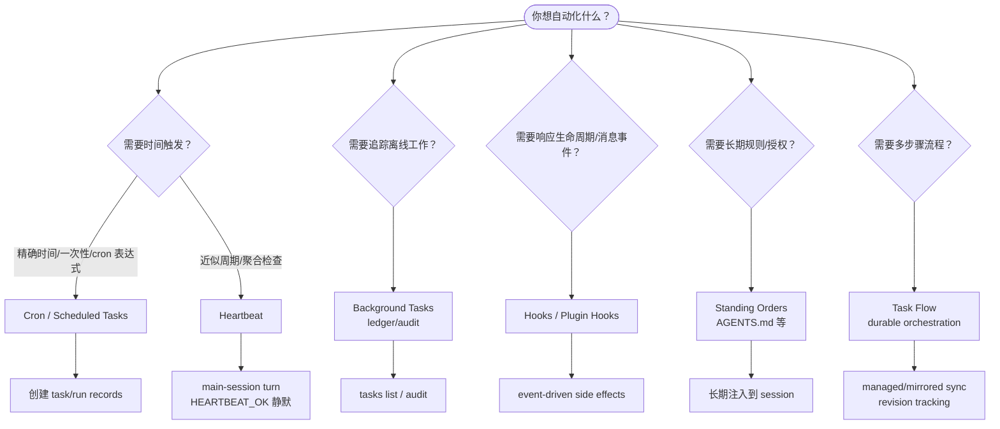

# 11｜Automation Layer：Heartbeat、Cron、Hooks、Tasks、Standing Orders 如何分工

## 读者问题

OpenClaw 的自动化层由哪些机制组成？

前两篇分别讲了 Heartbeat 和 Cron。到这里需要收一下：OpenClaw 不是只有一种“自动化”。它把不同类型的自动运行拆成多种机制：Heartbeat、Cron、Background Tasks、Task Flow、Hooks、Standing Orders。

这些东西如果混在一起，读者会很容易以为 OpenClaw 只是“能定时跑 Agent”。但真正的设计价值在于：它没有用一个巨型 scheduler 解决所有问题，而是让每种自动化机制负责不同边界。

## 本篇结论

OpenClaw 的 automation layer 可以按五类问题理解：

1. **要不要定期醒来看看？** 用 Heartbeat。
2. **要不要在精确时间执行 job？** 用 Cron / Scheduled Tasks。
3. **要不要追踪 detached work？** 用 Background Tasks。
4. **要不要响应生命周期或消息流事件？** 用 Hooks / Plugin hooks。
5. **要不要给 Agent 长期操作授权和规则？** 用 Standing Orders。

如果再往上，还有 Task Flow：它不是单个后台任务，而是管理多步骤流程、revision 和 sync mode 的编排层。

所以 OpenClaw 的自动化不是一个功能，而是一组边界清晰的运行时表面。

## 源码锚点

- `docs/automation/index.md`：自动化总览与 decision guide。
- `docs/automation/cron-jobs.md`：Scheduled Tasks / Cron。
- `docs/gateway/heartbeat.md`：Heartbeat。
- `docs/automation/tasks.md`：Background Tasks ledger。
- `docs/automation/taskflow.md`：Task Flow。
- `docs/automation/hooks.md`：Lifecycle hooks。
- `docs/automation/standing-orders.md`：Standing Orders。
- `src/agents/tools/cron-tool.ts`：Agent 创建和管理 Cron job 的工具入口。
- `src/gateway/server-cron.ts`：Gateway Cron 接入点。
- `src/infra/heartbeat-runner.ts`：Heartbeat runner。

## 先看机制图



这张图要表达的是：OpenClaw 自动化层不是“所有事情都交给 cron”，而是按时间、工作状态、事件、规则、流程五个维度拆开。

<!-- IMAGEGEN_PLACEHOLDER:
title: 11｜Automation Layer：OpenClaw 自动化机制分工图
type: system-map
purpose: 用一张正式中文技术架构图解释 Heartbeat、Cron、Background Tasks、Task Flow、Hooks、Standing Orders 在 OpenClaw 自动化层中的分工
prompt_seed: 生成一张 16:9 中文技术架构图，主题是 OpenClaw Automation Layer。中心是“Automation Need”，向外分为 Heartbeat、Cron、Background Tasks、Task Flow、Hooks、Standing Orders 六个模块，并标注各自负责：周期检查、精确调度、离线工作审计、多步骤流程、事件响应、长期规则。高对比、工程化、少量标签、无 logo、无水印。
asset_target: docs/assets/11-automation-layer-imagegen.png
status: pending
-->

## 第一类：Heartbeat，周期存在感

Heartbeat 负责“定期醒来看看”。它默认每 30 分钟，可以读取 `HEARTBEAT.md` 或 prompt，在主会话中检查是否有需要用户注意的东西。

它的关键不是精确时间，而是低频 presence：

- inbox、calendar、notifications 这类检查可以被 batching 到一个 turn；
- 没事时 `HEARTBEAT_OK` 静默；
- 可以用 active hours 避免夜间骚扰；
- 可以用 light context / isolated session 控制成本。

所以 Heartbeat 是一种“有事提醒、没事消失”的自动化。

## 第二类：Cron，精确承诺

Cron 负责精确 schedule：一次性 `at`、固定间隔 `every`、cron expression。它运行在 Gateway 内，持久化 `jobs.json` 和 `jobs-state.json`，并根据 session target 选择 main、isolated、current 或 custom session。

和 Heartbeat 最大区别是：Cron 代表一个明确 job。所有 cron executions 都创建 background task records，并可以通过 announce、webhook 或 none 控制结果投递。

如果用户说“明早 9 点提醒我”或“每天 7 点发简报”，这不是 heartbeat checklist，而应该落成 Cron job。

## 第三类：Background Tasks，追踪 detached work

Background Tasks 不是 scheduler。`docs/automation/index.md` 写得很清楚：The background task ledger tracks all detached work。它记录 ACP runs、subagent spawns、isolated cron executions、CLI operations 等离线工作。

这层解决的问题是审计和状态：

- 哪些后台工作正在跑？
- 哪些已经完成？
- 哪些丢失或失败？
- 用户如何查看 run history？

所以 Tasks 是自动化层的账本，不是触发器。

## 第四类：Task Flow，多步骤流程

Task Flow 位于 Background Tasks 之上。它管理 durable multi-step flows，有 managed / mirrored sync modes、revision tracking，以及 `openclaw tasks flow list|show|cancel` 这类检查入口。

如果 Background Task 是一个 detached run，那么 Task Flow 更像一串可追踪的计划：研究、执行、修订、汇总。它解决的是“多个后台步骤如何形成一个流程”，而不是“某个时间点要不要运行”。

这让 OpenClaw 可以从单次自动化走向长期工作流。

## 第五类：Hooks，事件驱动反应

Hooks 负责响应事件，而不是响应时间。文档中列出的触发点包括：`/new`、`/reset`、`/stop`、session compaction、gateway startup、message flow。Plugin hooks 还能覆盖 tool calls、prompt、message、lifecycle 等 in-process 表面。

这类机制适合：

- session reset 时运行清理脚本；
- compaction 前后做额外处理；
- 每次 tool call 前后做检查；
- 消息流进入或退出时做转换。

如果说 Cron 是“到点做”，Hooks 就是“事件发生时做”。

## 第六类：Standing Orders，长期操作授权

Standing Orders 是另一种容易被忽视的自动化。它不是立即触发某个 run，而是给 Agent 一组长期操作规则和授权边界，通常放在 workspace 文件里，比如 `AGENTS.md`。

它回答的是：Agent 在未来每次运行时，应该持续遵守哪些规则？

这和 Cron 可以组合：Cron 负责“什么时候做”，Standing Orders 负责“以什么原则做”。也和 Hooks 不同：Hooks 是事件脚本，Standing Orders 是进入 Agent prompt 的长期行为约束。

## 为什么要拆这么多层

如果把这些机制都塞进 Cron，会出现几个问题：

- 周期检查会变成大量精确 job，噪音和管理成本上升；
- detached work 没有独立账本，用户不知道后台到底发生了什么；
- 生命周期事件只能伪装成时间触发，不够准确；
- 长期授权和规则会被写进一次性 job，难以复用；
- 多步骤流程缺少 revision 和 sync 管理。

OpenClaw 的分层让每个机制只解决自己的问题。这对长期运行时很重要：自动化越多，边界越要清楚，否则系统会很快变成一堆隐式触发器。

## 决策表：该用哪一个

| 需求 | 应该用什么 | 原因 |
| --- | --- | --- |
| 每 30 分钟看看有没有重要消息 | Heartbeat | 近似周期、聚合检查、没事静默 |
| 明天 9 点提醒我 | Cron | 精确一次性时间 |
| 每周一生成报告并发到 Slack | Cron + delivery | 精确调度、isolated run、announce |
| 查看后台 subagent 是否完成 | Background Tasks | 账本和审计 |
| 多步骤研究、反复修订、最终汇总 | Task Flow | 持久流程和 revision |
| 每次 session reset 后跑清理 | Hooks | 生命周期事件触发 |
| 永远按某个规则检查合规 | Standing Orders | 长期注入的行为边界 |

## 和 OpenClaw 主线的关系

到这里，OpenClaw 的核心差异更完整了：

```text
Memory 让系统能保留长期状态。
Heartbeat 让系统能周期醒来。
Cron 让系统能履行精确时间承诺。
Tasks / Task Flow 让后台工作可追踪。
Hooks / Standing Orders 让事件反应和长期规则进入运行时。
```

这就是为什么 OpenClaw 不只是“一个有工具的聊天 Agent”。它在把真实世界中的时间、事件、后台工作和长期规则都接入 agent runtime。

## Readability-coach 自检

- **一句话问题是否回答了？** 是。本文把 automation layer 拆成 Heartbeat、Cron、Tasks、Task Flow、Hooks、Standing Orders。
- **有没有把自动化简化成 Cron？** 没有。文中明确每层边界和适用场景。
- **有没有和 09 / 10 接上？** 有。Heartbeat 和 Cron 的边界被再次收束，并扩展到更大的自动化层。
- **有没有避免无关项目叙事？** 有。

## Takeaway

OpenClaw 的自动化层不是一个 scheduler，而是一组运行时边界：时间触发、周期检查、后台账本、流程编排、事件反应、长期规则各管一段。

理解这层分工后，OpenClaw 的产品路线就更清楚了：它不是把 Agent 变成一个更大的命令行工具，而是把 Agent 放进真实世界的时间、事件和长期承诺里。
