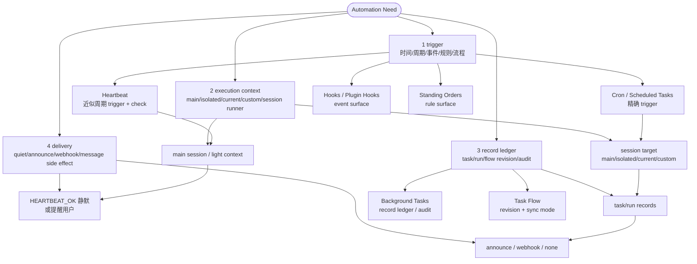
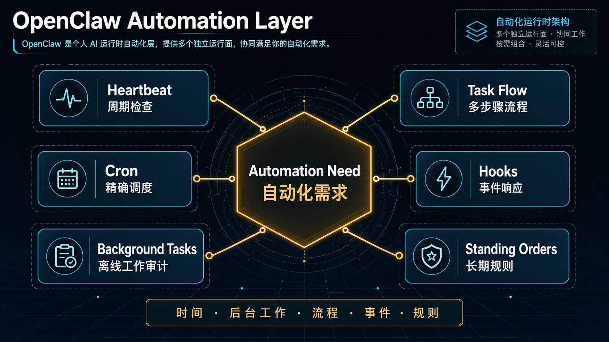

# 11｜Automation Layer：Heartbeat、Cron、Hooks、Tasks、Standing Orders 如何分工

## 读者问题

OpenClaw 的自动化层由哪些机制组成？

前两篇分别讲了 Heartbeat 和 Cron。到这里需要收一下：OpenClaw 的“自动化”以一组运行时表面呈现：Heartbeat、Cron、Background Tasks、Task Flow、Hooks、Standing Orders。

读这一层时，可以先抓住四个维度：**trigger**（什么会让它启动）、**execution context**（在哪个 session / runner 里执行）、**record ledger**（有没有可追踪的任务或运行记录）、**delivery**（结果怎样通知用户或外部系统）。四个维度一拆开，Heartbeat、Cron、Tasks、Hooks、Standing Orders 的分工就会变得稳定。

## 本篇结论

OpenClaw 的 automation layer 可以先按四维框架理解：

1. **trigger**：时间、近似周期、事件、规则，还是人工/流程推进。
2. **execution context**：main session、isolated session、current/custom session、gateway runner，还是 plugin/process 内部表面。
3. **record ledger**：是否产生 task、run、flow revision、audit history。
4. **delivery**：静默、announce、webhook、消息流副作用，还是仅作为 prompt 规则持续生效。

落到具体机制上，可以按五类问题判断：

1. **要不要定期醒来看看？** 用 Heartbeat。
2. **要不要在精确时间执行 job？** 用 Cron / Scheduled Tasks。
3. **要不要追踪 detached work？** 用 Background Tasks。
4. **要不要响应生命周期或消息流事件？** 用 Hooks / Plugin hooks。
5. **要不要给 Agent 长期操作授权和规则？** 用 Standing Orders。

再往上还有 Task Flow：它把多个 detached run 组织成可修订、可同步的流程。

这一章要把 09-12 章串起来：**Heartbeat = trigger + check + optional delivery，没有 task ledger；Cron = precise trigger + session + task/run log + delivery；Background Tasks = record ledger；Hooks / Standing Orders = event / rule surface**。所以，OpenClaw 的自动化是一张分工图，无需退回到巨型 scheduler。

## 源码锚点

- `docs/automation/index.md`：自动化总览与 decision guide。
- `docs/automation/cron-jobs.md`：Scheduled Tasks / Cron。
- `docs/gateway/heartbeat.md`：Heartbeat。
- `docs/automation/tasks.md`：Background Tasks ledger。
- `docs/automation/taskflow.md`：Task Flow。
- `docs/automation/hooks.md`：Lifecycle hooks。
- `docs/automation/standing-orders.md`：Standing Orders。
- `src/agents/tools/cron-tool.ts`：Agent 创建和管理 Cron job 的工具入口。
- `src/gateway/server-cron.ts`：Gateway Cron 接入点。
- `src/infra/heartbeat-runner.ts`：Heartbeat runner。

## 先看机制图



这张图想表达的是：OpenClaw 自动化层先拆四件事——trigger、execution context、record ledger、delivery，再把时间、工作状态、事件、规则、流程分别放到合适的机制里。配图之后再逐层解释，读者会更容易判断“谁负责启动、谁负责执行、谁负责留痕、谁负责投递”。

<!-- IMAGEGEN_PLACEHOLDER:
title: 11｜Automation Layer：OpenClaw 自动化机制分工图
type: system-map
purpose: 用一张正式中文技术架构图解释 Heartbeat、Cron、Background Tasks、Task Flow、Hooks、Standing Orders 在 OpenClaw 自动化层中的分工
prompt_seed: 生成一张 16:9 中文技术架构图，主题是 OpenClaw Automation Layer。中心是“Automation Need”，向外分为 Heartbeat、Cron、Background Tasks、Task Flow、Hooks、Standing Orders 六个模块，并标注各自负责：周期检查、精确调度、离线工作审计、多步骤流程、事件响应、长期规则。高对比、工程化、少量标签、无 logo、无水印。
asset_target: docs/assets/11-automation-layer-imagegen.png
status: generated
-->

<details class="imagegen-figure" markdown="1">
<summary>配图：展开查看 imagegen2 视觉概览</summary>



</details>

## 第一类：Heartbeat，周期存在感

Heartbeat 负责“近似周期地醒来看看”。放进四维框架里，它的 **trigger** 是低频周期 tick，**execution context** 通常是主会话或轻量上下文，**record ledger** 很轻，不把每次检查都变成用户需要管理的 task，**delivery** 则在“静默”和“提醒”之间切换。

它的重点是低频 presence：

- inbox、calendar、notifications 这类检查可以被 batching 到一个 turn；
- 没事时用 `HEARTBEAT_OK` 静默；
- 可以用 active hours 避免夜间骚扰；
- 可以用 light context / isolated session 控制成本。

所以 Heartbeat 是一种“有事提醒、没事消失”的自动化：trigger 负责唤醒，context 负责检查，delivery 负责克制地打断用户。

## 第二类：Cron，精确承诺

Cron 负责精确 schedule：一次性 `at`、固定间隔 `every`、cron expression。四维拆开看，它的 **trigger** 是明确时间承诺；**execution context** 由 session target 决定，可以是 main、isolated、current 或 custom session；**record ledger** 由 cron execution 创建 background task / run records；**delivery** 可以是 announce、webhook 或 none。

它运行在 Gateway 内，持久化 `jobs.json` 和 `jobs-state.json`。如果用户说“明早 9 点提醒我”或“每天 7 点发简报”，就应该落成一个带时间、session、记录和投递策略的 Cron job。

## 第三类：Background Tasks，追踪 detached work

Background Tasks 是四维框架里的 **record ledger**。`docs/automation/index.md` 写得很清楚：The background task ledger tracks all detached work。它记录 ACP runs、subagent spawns、isolated cron executions、CLI operations 等离线工作，让自动化从“我记得好像跑过”变成可查询的状态历史。

这层解决的是审计和状态：

- 哪些后台工作正在跑？
- 哪些已经完成？
- 哪些丢失或失败？
- 用户如何查看 run history？

所以 Tasks 这一层专心回答 ledger 问题：后台发生了什么、现在是什么状态、之后如何审计。

## 第四类：Task Flow，多步骤流程

Task Flow 位于 Background Tasks 之上。它管理 durable multi-step flows，有 managed / mirrored sync modes、revision tracking，以及 `openclaw tasks flow list|show|cancel` 这类检查入口。

如果 Background Task 是一个 detached run，那么 Task Flow 更像一串可追踪的计划：研究、执行、修订、汇总。它把 ledger 从单条 run 扩展成 flow-level 的 revision history，并用 sync mode 决定流程和当前会话如何对齐。

这让 OpenClaw 可以从单次自动化走向长期工作流。

## 第五类：Hooks，事件驱动反应

Hooks 负责事件型 **trigger**。文档中列出的触发点包括：`/new`、`/reset`、`/stop`、session compaction、gateway startup、message flow。Plugin hooks 还能覆盖 tool calls、prompt、message、lifecycle 等 in-process 表面。它们的 execution context 通常贴近 lifecycle 或 plugin runtime，delivery 往往体现为消息流转换、工具调用前后处理或其他 side effects。

这类机制适合：

- session reset 时运行清理脚本；
- compaction 前后做额外处理；
- 每次 tool call 前后做检查；
- 消息流进入或退出时做转换。

如果说 Cron 是“到点做”，Hooks 就是“事件发生时做”：trigger 来源不同，后续是否留 ledger、如何 delivery，由具体 hook 的作用面决定。

## 第六类：Standing Orders，长期操作授权

Standing Orders 是另一种容易被忽视的自动化。它提供规则型 **trigger surface**：不一定立刻启动某个 run，而是在未来每次相关执行中持续影响 Agent 的判断和授权边界，通常放在 workspace 文件里，比如 `AGENTS.md`。

它回答的是：Agent 在未来每次运行时，应该持续遵守哪些规则？

这和 Cron 可以组合：Cron 负责“什么时候做”，Standing Orders 负责“以什么原则做”。和 Hooks 相比，它更接近进入 Agent prompt 的长期行为约束，比一次事件回调更持久。

## 为什么要拆这么多层

四维框架的价值在于避免把 trigger、execution context、record ledger、delivery 绑死在同一个实现里。机制拆开后，会得到几个直接收益：

- 周期检查可以保持低频、聚合、没事静默；
- 精确时间承诺可以落到 Cron，并配套 session、run log 和 delivery；
- detached work 有独立账本，用户知道后台到底发生了什么；
- 生命周期事件直接走 Hooks，规则面直接走 Standing Orders；
- 多步骤流程有 revision 和 sync 管理。

OpenClaw 的分层让每个机制只解决自己的问题。这对长期运行时很重要：自动化越多，边界越要清楚，否则系统很快会变成一堆难以解释的隐式触发器。

## 决策表：该用哪一个

| 需求 | 应该用什么 | 四维判断 |
| --- | --- | --- |
| 每 30 分钟左右看看有没有重要消息 | Heartbeat | 近似周期 trigger；主会话检查；无重 ledger；没事静默 |
| 明天 9 点提醒我 | Cron | 精确一次性 trigger；选定 session；创建 run 记录；按策略投递 |
| 每周一生成报告并发到 Slack | Cron + delivery | cron trigger；isolated run；task/run log；announce/webhook |
| 查看后台 subagent 是否完成 | Background Tasks | 关注 record ledger 和 audit history |
| 多步骤研究、反复修订、最终汇总 | Task Flow | flow-level ledger；revision tracking；sync mode |
| 每次 session reset 后跑清理 | Hooks | lifecycle event trigger；runtime side effect |
| 永远按某个规则检查合规 | Standing Orders | rule surface；进入 prompt/context；长期生效 |

## 和 OpenClaw 主线的关系

到这里，OpenClaw 的差异会更完整：

```text
Memory 让系统能保留长期状态。
Heartbeat 提供近似周期 trigger、检查 context 和可选 delivery。
Cron 提供精确 trigger、session context、task/run ledger 和 delivery。
Tasks / Task Flow 提供后台工作与多步骤流程的 record ledger。
Hooks / Standing Orders 让事件触发和长期规则进入运行时表面。
```

这也是 OpenClaw 不只是“一个有工具的聊天 Agent”的原因。它把真实世界中的时间、事件、后台工作和长期规则，拆成 trigger、execution context、record ledger、delivery 四个可组合维度接入 agent runtime。

## 本章检查点

读完这一章，你应该能：

- 能用 trigger、execution context、record ledger、delivery 四个维度拆开 OpenClaw 自动化。
- 能区分 Heartbeat、Cron、Background Tasks、Task Flow、Hooks、Standing Orders 的职责。
- 能判断为什么 OpenClaw 自动化需要拆成多层运行时表面。


## Takeaway

OpenClaw 的自动化层可以用四维框架阅读：trigger 决定何时启动，execution context 决定在哪里运行，record ledger 决定如何留痕，delivery 决定结果如何抵达用户或系统。

理解这层分工后，OpenClaw 的产品路线就更清楚了：它不是把 Agent 变成一个更大的命令行工具，而是把 Agent 放进真实世界的时间、事件和长期承诺里。
