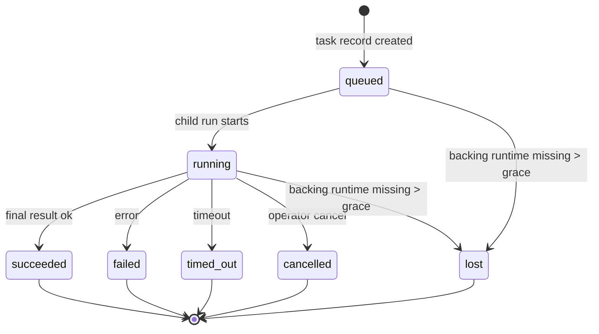
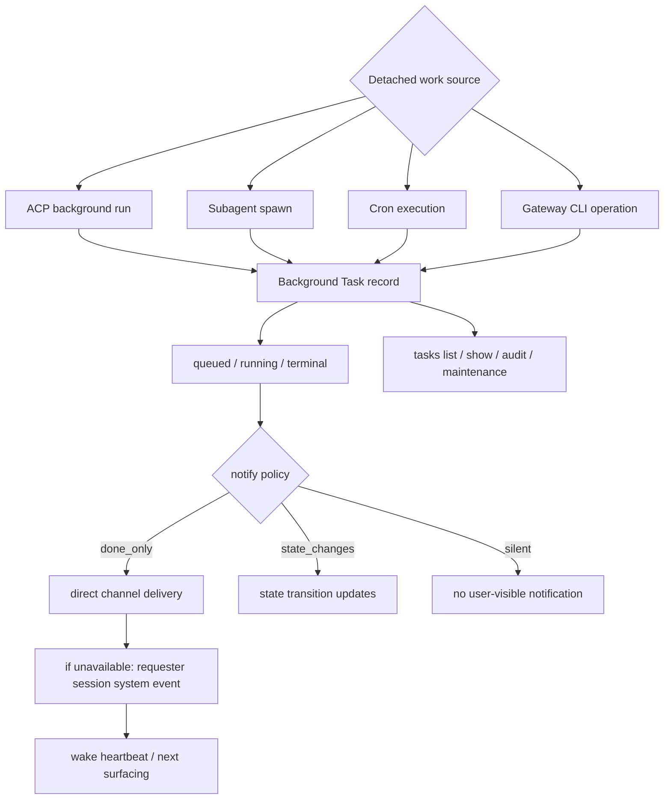

# 12｜Background Tasks 与 Subagent：OpenClaw 如何记录 detached work

## 读者问题

OpenClaw 中哪些工作会脱离当前对话继续运行？如何被审计？

在普通聊天式 Agent 里，用户通常只关心当前这一轮：我发一句话，模型做一点工具调用，然后给一个最终回答。即使中间跑了脚本或调用工具，大多数时候也会被理解成“这轮对话的一部分”。

OpenClaw 的运行时更复杂。Cron 可以在后台触发，ACP run 可以另开执行上下文，subagent 可以被派出去做独立任务，CLI 操作也可能通过 Gateway 跑一个 agent turn。这些工作不一定和当前聊天同步结束，但用户仍然需要知道：它们是否开始了、跑到哪里、是否成功、失败后有没有通知。

这就是 Background Tasks 要解决的问题。

## 本篇结论

Background Tasks 不是调度器，也不是新的 Agent 类型。它是 OpenClaw 的**后台工作账本**：记录那些脱离主对话 session 运行的工作，追踪它们从 `queued` 到 `running`，再到 `succeeded / failed / timed_out / cancelled / lost` 的生命周期，并把完成结果直接投递到渠道，或排队到 requester session 的下一次 heartbeat。

它和前面几篇的边界是：

- Heartbeat 决定“周期醒来看看”，但 heartbeat turn 不创建 task；
- Cron 决定“到点执行 job”，所有 cron executions 都创建 task；
- Subagent / ACP / CLI 代表 detached work 的来源；
- Tasks 负责“发生过什么、现在什么状态、如何通知和审计”。

所以 Tasks 的产品价值不在于“多一个列表命令”，而在于让 OpenClaw 的后台自动化变得可见、可取消、可审计。

## 源码锚点

- `docs/automation/tasks.md`：Background Tasks 的定义、创建来源、生命周期、通知策略和审计命令。
- `docs/automation/taskflow.md`：Task Flow 如何位于 task 之上，管理多步骤流程。
- `docs/automation/index.md`：Tasks 与 Cron / Heartbeat / Hooks / Standing Orders 的分工。
- `docs/concepts/multi-agent.md`：多 agent 的 workspace、agentDir、session store、binding 和隔离边界。
- `src/tasks/task-registry.store.ts`：task registry 的持久化存储。
- `src/tasks/task-registry.types.ts`：task record、status、runtime 等类型边界。
- `src/tasks/task-domain-views.ts`：面向不同 runtime 的 task 视图。
- `src/tasks/task-flow-registry.ts`：Task Flow registry。
- `src/tasks/detached-task-runtime-contract.ts`：detached task runtime 合约。
- `src/plugins/runtime/runtime-tasks.ts`：plugin/runtime 层暴露 tasks 能力。
- `src/commands/tasks.ts`：openclaw tasks CLI 入口。
- `src/cron/isolated-agent/run.ts`：isolated cron run 如何进入 agent turn、delivery trace、session 与 skills snapshot。

## 先看机制图





这两张图要分开看：第一张是单个 task 的状态机，第二张是 task 从 detached source 到通知与审计的运行链路。

<!-- IMAGEGEN_PLACEHOLDER:
title: 12｜Background Tasks：OpenClaw 后台工作账本
type: lifecycle-map
purpose: 用一张正式中文技术架构图解释 ACP、Subagent、Cron、CLI 等 detached work 如何创建 task record、更新状态，并通过 direct delivery 或 heartbeat wake 通知用户
prompt_seed: 生成一张 16:9 中文技术架构图，主题是 OpenClaw Background Tasks。左侧是 ACP/Subagent/Cron/CLI 来源，中间是 Task Registry 和 queued/running/terminal 状态机，右侧是 direct channel delivery、requester session event、heartbeat wake、tasks audit。高对比、工程化、少量标签、无 logo、无水印。
asset_target: docs/assets/12-background-tasks-subagent-imagegen.png
status: pending
-->

## Task 是记录，不是调度器

`docs/automation/tasks.md` 开头就先划边界：如果你在找 scheduling，看 Automation & Tasks；这个页面讲的是 tracking background work，不是 scheduling。

这句话很重要。Tasks 不决定工作什么时候运行。时间由 Cron 和 Heartbeat 决定；事件反应由 Hooks 决定；长期规则由 Standing Orders 决定。Tasks 只负责记录：某个 detached work 被创建了、开始了、结束了、失败了还是丢了。

这也是为什么文档说：Tasks are records, not schedulers。

如果把 Tasks 误解为调度器，自动化层就会被讲乱。更准确的理解是：Tasks 是运行时账本。

## 哪些东西会创建 task

文档列得很清楚：

| 来源 | runtime type | 何时创建 task |
| --- | --- | --- |
| ACP background runs | `acp` | spawn child ACP session 时 |
| Subagent orchestration | `subagent` | 通过 `sessions_spawn` spawn subagent 时 |
| Cron jobs | `cron` | 每一次 cron execution |
| CLI operations | `cli` | `openclaw agent` 命令经 Gateway 运行时 |
| Agent media jobs | `cli` | session-backed `video_generate` 等异步媒体任务 |

反过来，哪些不会创建 task 也同样重要：Heartbeat turns、normal interactive chat turns、direct `/command` responses。

这条边界可以这样记：**离开主对话同步路径、需要后台追踪的工作，才进入 task ledger。**

## 生命周期：为什么需要 `lost`

Task 生命周期看起来像常规状态机：`queued → running → terminal`。terminal 包括 succeeded、failed、timed_out、cancelled。但 OpenClaw 多了一个很有运行时味道的状态：`lost`。

`lost` 不是“失败”的同义词，它表示 runtime ownership 消失：

- ACP task：背后的 ACP child session metadata 不见了；
- Subagent task：目标 agent store 里的 child session 不见了；
- Cron task：cron runtime 不再追踪这个 job；
- CLI task：chat-backed CLI task 看 live run context，而不只看 chat session row。

这说明 OpenClaw 没有把 task record 当成孤立数据库行。它会和背后的真实 runtime 做 reconciliation。记录说它还在跑，但 runtime 已经不再拥有它，就需要进入 `lost`，并在 audit 中暴露。

## 通知：不要让用户轮询后台任务

OpenClaw 的 task completion 是 push-driven。文档说得很直接：detached work 可以直接通知，或在完成时 wake requester session / heartbeat，所以通常不应该写状态轮询循环。

通知有两条路径：

1. **Direct delivery**：如果 task 有 channel target，也就是 `requesterOrigin`，完成消息直接发回 Telegram、Discord、Slack 等真实渠道；
2. **Session-queued delivery**：如果 direct delivery 失败或没有 origin，更新会被排成 requester session 的 system event，在下一次 heartbeat 或 wake 中浮现。

这和前面的 Heartbeat、Cron 连起来了：后台工作完成后，不需要等用户回来追问，运行时会主动把结果送回用户所在的渠道或 session。

## Notify policy：同一类后台工作，不一定同样吵

Task 有通知策略：

| Policy | 含义 |
| --- | --- |
| `done_only` | 只通知 terminal 状态，默认用于 ACP / subagent |
| `state_changes` | 每次状态变化都通知 |
| `silent` | 不通知，默认用于 cron / CLI 等场景 |

Cron tasks 默认 silent，并不意味着不记录，只是避免每个定时任务都打扰用户。Subagent 默认 done_only，则更符合用户期望：别一直报进度，完成时告诉我结果。

这也是 OpenClaw 自动化层的细节：同样是后台工作，通知强度要和使用场景匹配。

## Subagent：带 requester 的 detached work

Subagent 在 OpenClaw 里容易被误读成“多开几个模型窗口”。从 tasks 视角看，它更像一个有归属的 detached run：由当前 session 发起，创建 child session，记录 task，完成后把结果回送给 requester。

`docs/automation/tasks.md` 特别提到 subagent completion 会尽量保留 thread / topic routing；如果缺少 `to` 或 account，还会从 requester session 的 stored route（`lastChannel` / `lastTo` / `lastAccountId`）补齐。

这说明 subagent 的难点不只是“并发执行”，还包括“完成之后回到哪里”。OpenClaw 必须保留发起者、渠道、线程、账号这些 routing 信息，否则后台结果可能会丢到错误地方。

## Task Flow：任务账本之上的流程层

Task Flow 不替代 Tasks。它位于 task 之上，用来管理 durable multi-step flows。

单个 task 记录“一次 detached work”；Task Flow 管理“一串 work 如何推进”。例如一个市场情报工作流：preflight、collect、summarize、approve、deliver。每一步可能对应一个 task，flow 负责步骤关系、revision tracking、cancel intent 和 gateway restart 后恢复。

这就是 Automation Layer 的第二层：

```text
Task：一个后台动作的记录。
Task Flow：多个后台动作组成的流程状态机。
```

## 审计：后台系统不能只靠“我记得”

OpenClaw 提供 `openclaw tasks list`、`show`、`cancel`、`notify`、`audit`、`maintenance`。这些命令不是运维装饰，而是长期运行时必需品。

因为一旦 Agent 能自己定时、自己派 subagent、自己异步生成媒体，系统就必须回答：

- 哪些后台工作还在跑？
- 哪些卡住了？
- 哪些 delivery failed？
- 哪些 task terminal 了但缺 cleanup？
- 哪些状态时间线不一致？

这也是 OpenClaw 和一次性 CLI agent 的区别：自动化越强，审计面越重要。

## Readability-coach 自检

- **一句话问题是否回答了？** 是。本文解释了哪些 detached work 会创建 task，以及如何被状态机、通知策略和审计命令追踪。
- **有没有把 Tasks 写成调度器？** 没有。明确 Tasks 是 records，不决定 when。
- **有没有解释 Subagent 的运行时边界？** 有。强调 child session、requester、delivery route 和 task record。
- **有没有和 Heartbeat / Cron 接上？** 有。Heartbeat 不创建 task，Cron execution 创建 task，completion 可 wake heartbeat。
- **有没有避免无关项目叙事？** 有。

## Takeaway

Background Tasks 是 OpenClaw 自动化可信度的底座。Cron、subagent、ACP、CLI 都可以把工作放到后台，但只有 task ledger 能让这些工作变得可见、可取消、可审计，并在完成时回到正确的用户和渠道。
