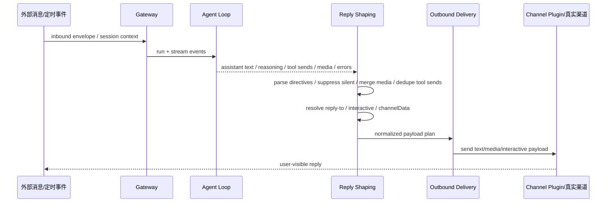
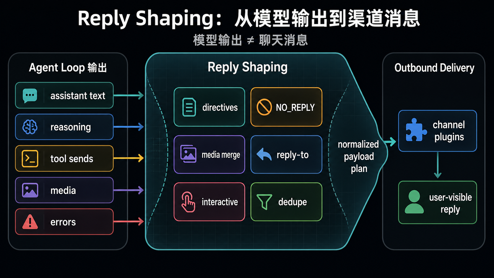

# 13｜Reply Shaping：为什么聊天渠道需要一层回复整形

## 读者问题

为什么模型输出不能直接等于聊天消息？

如果只用命令行 coding agent，模型吐出一段文本，终端打印出来，通常就结束了。但 OpenClaw 面向的是 Telegram、Discord、Slack、Matrix、WhatsApp、WebChat、cron announce、webhook、heartbeat delivery 这些真实渠道。它们有各自的线程、媒体、按钮、回复引用、静默规则，也有投递失败后的处理方式。

因此，OpenClaw 不能把“模型最后说的话”直接当成“发给用户的消息”。中间需要一层 Reply Shaping，也就是回复整形。

## 本篇结论

Reply Shaping 位于 agent run 和真实渠道之间。它把模型输出、工具发送、媒体、reasoning、silent token、reply-to、interactive payload、channelData、duplicate suppression、fallback error 等信息整理成可以投递的 outbound payload。

它处理的不是 Markdown 美化，而是运行时边界：**模型说了什么，不等于用户应该在某个渠道看到什么。**

## 源码锚点

- `docs/concepts/agent-loop.md`：agent loop、streaming、tool execution、reply shaping、suppression 的整体说明。
- `src/auto-reply/reply/reply-payloads.ts`：reply payload 是否可渲染、reasoning suppression、btw text formatting 等。
- `src/auto-reply/reply/reply-directives.ts`：从文本中解析 reply/media/silent 等 directive。
- `src/auto-reply/reply/session-delivery.ts`：session delivery route、last channel / last to、thread/account preservation。
- `src/auto-reply/reply/streaming-directives.ts`：streaming 相关 directive。
- `src/auto-reply/reply/typing.ts` 与 `src/auto-reply/reply/typing-policy.ts`：typing indicator 与策略。
- `src/infra/outbound/payloads.ts`：outbound payload plan，silent、media、presentation、interactive、channelData 等归一化。
- `src/infra/outbound/reply-policy.ts`：reply-to consumption / fanout 策略。
- `src/infra/outbound/targets.ts`：heartbeat / outbound target 解析。
- `src/infra/outbound/deliver.ts`：outbound payload delivery。
- `src/infra/outbound/sanitize-text.ts`：外发文本清理。
- `src/plugin-sdk/reply-payload.ts`：插件侧 reply payload 可发送部分的 SDK 合约。

## 先看机制图

读这张图时，不要把 Reply Shaping 理解成“把文字排漂亮”。它解决的是投递边界：模型输出只是输入之一；工具可能已经发过消息，payload 可能带媒体，channel 可能需要 reply-to 或 thread id，还有一些文本应该被静默丢弃。

<!-- IMAGEGEN_PLACEHOLDER:
title: 13｜Reply Shaping：从模型输出到渠道消息
type: pipeline-diagram
purpose: 用一张正式中文技术架构图解释模型输出为什么不能直接等于聊天消息，以及 OpenClaw 如何通过 Reply Shaping 生成可投递 payload
prompt_seed: 生成一张 16:9 中文技术架构图，主题是 OpenClaw Reply Shaping。左侧是 Agent Loop 输出：assistant text、reasoning、tool sends、media、errors；中间是 reply shaping：directives、NO_REPLY、media merge、reply-to、interactive、dedupe；右侧是 outbound delivery 和 channel plugins。高对比、工程化、少量标签、无 logo、无水印。
asset_target: docs/assets/13-reply-shaping-imagegen.png
status: generated
-->

图片把核心路径压成三段：Agent Loop 产出混合事件，Reply Shaping 判断哪些内容可见、可发、该发到哪里，Outbound / Channel 再把它翻译成平台消息。下面几节只沿着这条边界展开，不做源码目录游览。

## Agent loop 里的输出不是一种东西

`docs/concepts/agent-loop.md` 把 agent loop 拆成 intake、context assembly、model inference、tool execution、streaming replies、persistence。运行过程中会出现 assistant stream、tool stream、lifecycle stream。

到了输出阶段，OpenClaw 要组装 final payloads，来源包括：

- assistant text；
- optional reasoning；
- verbose 模式下允许展示的 inline tool summaries；
- 模型错误时的 assistant error text；
- 工具已经通过 messaging tool 发送过的用户可见消息；
- 媒体、音频、interactive blocks、channelData。

所以，“最终回复”不是一个字符串，而是一组 payload。Reply Shaping 的第一步，就是把这些混合输出变成可判断、可渲染、可投递的结构。后面的 `NO_REPLY`、去重、reply-to 和 fallback，都只是这个边界问题的不同切面。

## `NO_REPLY`：沉默也是一种合法输出

OpenClaw 支持 `NO_REPLY` / `no_reply`。文档说明：exact silent token 会从 outgoing payloads 里过滤。

这个功能看起来小，在渠道场景里却很常见。Agent 已经通过 tool 发出了真实消息，最后就不该再补一句“已发送”；某些自动化只更新内部状态，也不该发到用户聊天里。

`src/infra/outbound/payloads.ts` 里可以看到 silent payload 的处理逻辑：它会解析 reply directives，判断 payload 是否 silent、是否还有 media、是否有 pending spawned children。如果没有可见内容，且 silence 是合理的，就不会生成用户可见 payload。

这和 Heartbeat 的 `HEARTBEAT_OK` 有点像：运行时要允许“执行了，但不打扰”。区别在于，Heartbeat 的静默 token 服务于周期检查；`NO_REPLY` 服务于普通 reply / tool / channel 输出。

## Messaging tool duplicate suppression：别重复告诉用户同一件事

`docs/concepts/agent-loop.md` 明确说：Messaging tool sends are tracked to suppress duplicate assistant confirmations。

想象一个 Agent 调用 message tool 给 Slack 发了一条消息，最后模型又回复“我已经发到 Slack 了”。如果当前渠道就是用户所在的同一个聊天，这会变成重复噪音。message tool 已经产生了用户可见结果时，最终 assistant payload 就可能需要被抑制或改写。

这也是 Reply Shaping 的工作：它要知道哪些输出已经通过工具发生过，哪些仍然需要 fallback delivery。

## Outbound payload plan：把复杂 payload 变成可发送部分

`src/infra/outbound/payloads.ts` 是这一层的重要入口。它把 reply payload 归一化成 outbound payload plan：

- 解析文本里的 media URL / reply directive；
- 合并 `mediaUrl` 和 `mediaUrls`，并去重；
- suppress reasoning-only 或 relay housekeeping 文本；
- 识别 silent payload；
- 判断 presentation、interactive、channelData 是否存在；
- 调用 plugin SDK 的 `resolveSendableOutboundReplyParts` 取出实际可发的 text / media parts。

这里要抓住一点：“可发送”不等于“有 text”。一个 payload 可以没有普通文本，但有 media、interactive blocks、channelData；也可以有文本，却被 silent policy 丢弃。

## Reply-to：线程和引用不能交给模型猜

聊天渠道通常有 reply-to 或 thread 语义。OpenClaw 不能指望模型在文本里手写“回复上一条”。它需要在 outbound 层解析并消费 reply-to 策略。

`src/infra/outbound/reply-policy.ts` 里可以看到两个概念：

- `createReplyToFanout`：决定多个 payload 是否复用同一个 replyToId，还是 single-use；
- `createReplyToDeliveryPolicy`：根据 replyToMode、explicit/implicit replyToId，决定当前 payload 是否应该带 replyToId，以及隐式 reply 是否已经被消费。

这说明 Reply Shaping 也在维护渠道语义。比如有些渠道里，第一条回复引用用户消息即可，后续多条 payload 不应该全部挂同一个 reply-to，否则线程体验会很别扭。

## Session delivery route：回复要回到正确的位置

`src/auto-reply/reply/session-delivery.ts` 处理 lastChannel、lastTo、lastAccountId、lastThreadId 等信息。这个文件里有不少细碎判断，比如 internal/webchat 不应覆盖已经建立的 external delivery route，inter-session messages 不应把 Discord 或其他外部投递目标改成 webchat。

这些逻辑说明：OpenClaw 的回复不是“发回当前 stdout”。它要保存和恢复真实世界位置：哪个 channel、哪个 account、哪个 thread、哪个 DM 或 group。

这对 subagent completion、cron announce、heartbeat alert 尤其重要。后台结果可能在另一个 session 里生成，但最后仍要回到发起用户所在的渠道。

## Fallback error：没有可见 payload 时也要处理工具失败

`docs/concepts/agent-loop.md` 还提到一个边界：如果没有 renderable payloads，且 tool errored，会发出 fallback tool error reply，除非 messaging tool 已经发了用户可见回复。

这避免了一个很差的体验：工具失败了，但 reply shaping 又过滤掉所有内容，用户看起来像 Agent 没反应。OpenClaw 在这里把“沉默”与“吞掉错误”分开处理。

## Reply Shaping 和 Plugin / Channel 的关系

Reply Shaping 不应该知道每个渠道的所有细节。它负责形成通用 outbound payload plan；具体渠道如何发送 text、media、poll、button、thread reply，由 channel plugin 执行。

这也引出下一篇 Plugin / Channel：OpenClaw 的扩展点不是让每个插件各自发明一套 reply pipeline。core 先提供共享 message tool、payload plan、target/session 语义，再让 channel plugin 接管平台细节。

## Readability-coach 自检

- **一句话问题是否回答了？** 是。模型输出不能直接等于聊天消息，因为真实渠道需要静默、去重、媒体、reply-to、interactive、delivery route 和错误 fallback。
- **有没有把 Reply Shaping 写成 Markdown 美化？** 没有。本文强调运行时边界和 outbound payload plan。
- **有没有源码锚定？** 有。引用 agent-loop、payloads、reply-policy、session-delivery、plugin-sdk reply payload 等。
- **有没有接住前后文？** 有。前接 Background Tasks 的 completion delivery，后接 Plugin / Channel。
- **有没有避免无关项目叙事？** 有。

## Takeaway

Reply Shaping 是 OpenClaw 从模型世界走向真实渠道世界的转换层。它把“模型生成了什么”改写成一组运行时判断：什么该发、什么该静默、发到哪里、用什么 payload 形态发、怎样避免重复、怎样保留线程语义，以及失败时怎样给用户一个可见结果。没有这一层，聊天渠道里的 Agent 很容易变成会重复、会串线、会误投递的文本打印机。
