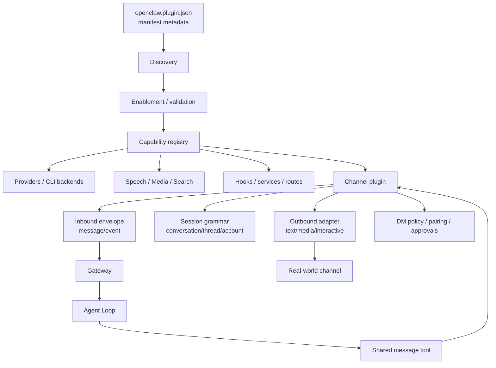

# 14｜Plugin 与 Channel：OpenClaw 如何扩展新的世界入口

## 读者问题

OpenClaw plugin 和普通 coding agent extension 有什么不同？

在很多 coding agent 里，extension 基本等同于“多一个工具”：给模型一个新函数，模型需要时调用它。这个心智模型用在 OpenClaw 上会失真。

OpenClaw 的 plugin 不只是工具扩展。它可以提供模型 provider、CLI backend、speech、realtime transcription、media understanding、image/music/video generation、web fetch/search、channel / messaging、gateway discovery、hooks、services、routes、memory 等能力。尤其是 Channel plugin，它不是“发消息工具”，而是把一个真实沟通平台接入 OpenClaw 运行时。

## 本篇结论

OpenClaw plugin 是运行时能力平面，不是单纯 tool list。它通过 manifest / discovery / enablement / validation / runtime registration，把外部世界的能力接入 Gateway、Agent loop、Message tool、Delivery、Hooks 和 Setup。

Channel plugin 则是一类特殊 plugin：它负责把 Telegram、Discord、Slack、Matrix、WhatsApp、Teams 等真实渠道变成 OpenClaw 的事件入口和结果出口，包括账号、DM 安全、pairing、session grammar、threading、outbound、typing、approval surface 等。

一句话：**普通 agent extension 多半是“模型能调用什么”；OpenClaw plugin 更像“运行时如何接入一个新世界”。**

## 源码锚点

- `docs/plugins/architecture.md`：plugin capability model、plugin shapes、load pipeline、channel plugin 边界。
- `docs/plugins/sdk-channel-plugins.md`：channel plugin 的 config、security、pairing、session grammar、outbound、threading、heartbeat typing 等职责。
- `docs/plugins/sdk-overview.md`：plugin SDK 注册 API。
- `docs/plugins/building-plugins.md`：manifest 与最小 plugin 包结构。
- `src/plugins/loader.ts`：plugin discovery / load 入口。
- `src/plugins/runtime/index.ts`：runtime registry 聚合。
- `src/plugins/runtime/types-core.ts`：runtime core 类型。
- `src/plugins/public-surface-loader.ts`：public surface loading。
- `src/plugins/public-surface-runtime.ts`：runtime public surface。
- `src/plugin-sdk/index.ts`：plugin SDK 主入口。
- `src/channels/plugins/index.ts`：channel plugin registry。
- `src/agents/tools/message-tool.ts`：共享 message tool 主机。
- `src/infra/outbound/*`：outbound target / payload / delivery 运行时。

## 先看机制图



这张图里，plugin 不是 agent loop 末端的一个函数，而是从 discovery 到 runtime surface，再到 inbound/outbound 的能力接入层。

<!-- IMAGEGEN_PLACEHOLDER:
title: 14｜Plugin 与 Channel：OpenClaw 的世界入口扩展层
type: architecture-map
purpose: 用一张正式中文技术架构图解释 OpenClaw plugin 不只是工具，而是 provider、channel、hooks、media、search、delivery 等运行时能力平面；重点突出 Channel plugin 如何连接真实世界入口和出口
prompt_seed: 生成一张 16:9 中文技术架构图，主题是 OpenClaw Plugin and Channel。左侧是 Manifest/Discovery/Validation/Capability Registry，中间是 Providers、Media、Hooks、Channel Plugin，右侧是 Inbound Envelope、Session Grammar、Shared Message Tool、Outbound Adapter、真实聊天渠道。高对比、工程化、少量标签、无 logo、无水印。
asset_target: docs/assets/14-plugin-channel-imagegen.png
status: pending
-->

## Capability model：插件注册的是能力，不只是工具

`docs/plugins/architecture.md` 的 public capability model 列出了一张表：Text inference、CLI inference backend、Speech、Realtime transcription、Realtime voice、Media understanding、Image generation、Music generation、Video generation、Web fetch、Web search、Channel / messaging、Gateway discovery。

这已经说明 OpenClaw plugin 的尺度：它接入的是运行时能力。一个 OpenAI plugin 可能同时拥有 text inference、speech、media understanding、image generation；一个 channel plugin 则让 OpenClaw 进入一个聊天平台。

这和“给模型加一个函数”完全不是一个层级。

## Plugin shapes：OpenClaw 关心插件实际注册了什么

OpenClaw 会按实际 registration behavior 把 plugin 分成几类：

| Shape | 含义 |
| --- | --- |
| `plain-capability` | 只注册一种 capability，比如 provider-only |
| `hybrid-capability` | 注册多种 capability，比如同时负责文本、语音、图像 |
| `hook-only` | 只注册 hooks，没有 capabilities/tools/commands/services |
| `non-capability` | 注册 tools、commands、services、routes，但没有 capability |

这里的重点是“实际注册行为”，不是只看静态 metadata。OpenClaw 要知道 plugin 到底扩展了运行时哪一块，才能做诊断、加载规划和兼容提示。

## 四层加载管线：control plane 先于 runtime

plugin architecture 文档把加载管线拆成四层：

1. **Manifest + discovery**：从路径、workspace、global roots、bundled plugins 中发现候选插件，先读 manifest；
2. **Enablement + validation**：决定 plugin 是 enabled、disabled、blocked，或被选为某个 exclusive slot；
3. **Runtime loading**：native plugin 通过 `register(api)` 把 capabilities 注册进 central registry；兼容 bundle 可以先归一化 registry record，而不导入 runtime code；
4. **Surface consumption**：OpenClaw 读取 registry，暴露 tools、channels、provider setup、hooks、HTTP routes、CLI commands、services。

这说明 OpenClaw 明确区分 control plane 和 runtime plane。manifest / schema / setup / diagnostics 应尽量不启动重 runtime；真正行为由 full registration path 激活。

这个设计对长期运行时很关键：Gateway 启动、status、doctor、setup、UI schema 都不能因为看一眼 plugin 就把所有客户端、socket、listener、subprocess 全部启动。

## Activation planning：需要什么才加载什么

文档里还有 activation planning：调用方可以在具体 command、provider、channel、route、agent harness、capability 场景下，先问“哪些 plugin 相关”，再决定加载更大的 runtime registry。

这不是性能洁癖，而是 Gateway 热路径的稳定性要求。聊天入口、status 命令、setup 表单、message tool schema 都可能频繁发生。如果每次都加载所有 channel/provider runtime，系统会慢，也更容易引入副作用。

所以 OpenClaw 的插件系统是 manifest-first、lazy runtime loading，而不是“启动时全量 require 所有扩展”。

## Channel plugin：不需要每个平台都发明一个 send 工具

Channel plugin 最重要的设计边界是：OpenClaw core 保留一个共享 `message` tool，channel plugin 不需要注册独立的 send/edit/react 工具。

`docs/plugins/architecture.md` 和 `docs/plugins/sdk-channel-plugins.md` 都强调这点：

- core owns shared `message` tool host、prompt wiring、session/thread bookkeeping、execution dispatch；
- channel plugins own scoped action discovery、capability discovery、channel-specific schema fragments；
- channel plugins own provider-specific session conversation grammar；
- channel plugins execute final action through their action adapter。

这能避免工具爆炸。否则每接入一个平台，模型 prompt 里就多一堆 `telegram_send`、`discord_reply`、`slack_react`，既难学也难维护。OpenClaw 让模型面对共享 message tool，而让 channel plugin 在背后决定这个 channel 能做什么。

## Session grammar：真实平台的 conversation 不是一个字符串

Channel plugin 还负责 session grammar：provider-specific conversation ids 如何映射成 base chat、thread id、parent fallback。

这件事非常现实。Telegram 有 topic，Discord 有 channel/thread，Slack 有 team/channel/thread_ts，Matrix 有 room，WhatsApp 有 direct/group。OpenClaw 不能把所有平台都硬编码进 core，也不能把这些差异丢给模型猜。

因此 channel plugin 通过 `messaging.resolveSessionConversation(...)` 等接口告诉 core：raw conversation id 应该如何拆解、父 conversation 候选是什么、thread 如何继承。

这也是 session routing 能跨渠道成立的前提。

## Security / pairing / approvals：channel 不是纯 transport

Channel plugin 还要处理 DM policy、allowlist、pairing、approvals、native approval routing 等安全边界。

这和普通工具插件不同。一个工具调用失败，最多是功能不可用；一个 channel 接入错误，可能意味着陌生人能 DM 你的 Agent、错误群聊能触发执行、approval 被送到错误用户手里。

所以 channel plugin 的职责包括：

- 哪些 DM 允许进入；
- pairing 如何完成；
- accountId 如何作用在多账号 channel；
- approval action 谁有权点；
- native approval payload 如何发送、更新、过期；
- thread / topic routing 如何保留。

这让 Channel plugin 成为 OpenClaw 安全边界的一部分，而不是简单的 transport adapter。

## Outbound media：插件声明参数，core 做通用保护

`docs/plugins/sdk-channel-plugins.md` 还提到，如果 channel 的 message-tool 参数携带 media source，比如本地路径或远程 media URL，plugin 应通过 `describeMessageTool(...).mediaSourceParams` 显式声明这些参数。

Core 之后用这份声明做 sandbox path normalization 和 outbound media-access hints，而不需要硬编码每个平台的 `avatarPath`、`attachmentUrl`、`coverImage`。

这体现了 OpenClaw 的一个稳定设计模式：平台知识留在插件，通用安全/归一化策略留在 core。

## Plugin 和 Reply Shaping 的接缝

上一章讲 Reply Shaping：core 先把模型输出整理成 outbound payload plan。到了这一章，Channel plugin 接管最后一段：这个 payload 在某个平台上如何发送。

两层边界可以这样记：

```text
Reply Shaping：决定“应该发什么 payload”。
Channel Plugin：决定“这个 payload 在该平台怎么发”。
```

前者是渠道无关的整形；后者是渠道有关注入真实世界。

## 为什么这不是普通 extension

普通 coding agent extension 往往只回答一个问题：模型还能调用什么工具？

OpenClaw plugin 要回答的问题更多：

- Gateway 如何发现和验证这个能力？
- 配置与 secret 如何声明？
- setup / doctor / status 如何在不启动 runtime 的情况下解释它？
- 什么时候需要 lazy load full runtime？
- 它是否提供 channel/provider/media/search/hook/service/route？
- 它如何参与 session routing、message tool、outbound delivery、approval、typing？
- 它对安全边界有什么影响？

这就是运行时插件和工具扩展的区别。

## Readability-coach 自检

- **一句话问题是否回答了？** 是。OpenClaw plugin 是运行时能力平面，Channel plugin 是真实世界入口/出口，不只是工具函数。
- **有没有把 plugin 写成工具列表？** 没有。重点放在 capability model、load pipeline、shared message tool、session grammar、security。
- **有没有和 Reply Shaping 接上？** 有。明确 payload shaping 与 channel execution 的边界。
- **有没有源码锚定？** 有。引用 plugin architecture、channel plugin docs、loader/runtime/public surface/message/outbound 等锚点。
- **有没有避免无关项目叙事？** 有。

## Takeaway

OpenClaw 的 plugin 系统不是“给模型多装几个工具”，而是把外部世界的能力以可发现、可验证、可懒加载、可诊断的方式接入运行时。Channel plugin 更进一步：它把真实聊天平台变成事件入口、会话边界、权限边界和结果出口。
