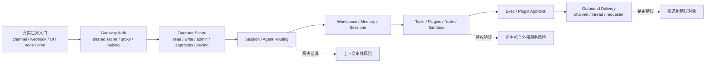
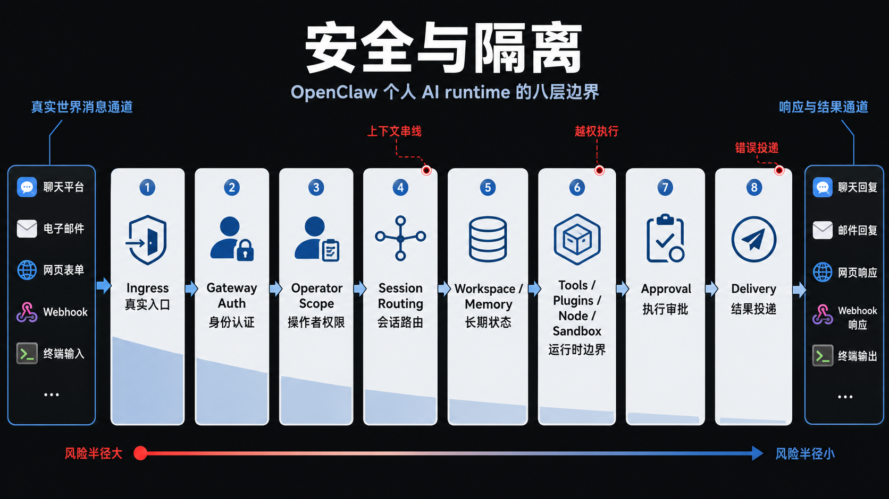

# 16｜安全与隔离：当 Agent 暴露给真实消息渠道之后

在终端里跑一个 coding agent，安全问题通常会被简化成两件事：它能不能读写这个仓库，它能不能执行这条命令。

OpenClaw 的边界更复杂。它面对的不只是一个终端用户，还包括真实消息渠道、Gateway 控制端、设备节点、cron、heartbeat、webhook、插件、记忆、投递和后台任务。消息从哪里来、属于哪个 session、能不能唤醒 agent、能不能触发工具、能不能写入记忆、结果投递到哪里，都会变成安全问题。

## 读者问题

OpenClaw 的安全边界为什么比 CLI coding agent 更复杂？

## 本篇先给结论

OpenClaw 的安全不是单点权限开关，而是一组横跨 ingress、身份、session、workspace、memory、tool/runtime、node、plugin、delivery 的运行时边界。CLI agent 默认把“当前终端用户”视为操作者；OpenClaw 默认面对“外部事件进入一个长期运行的个人 AI runtime”。因此，安全要从消息入口开始，不能等到 `exec` 前才开始。

## 先看一张机制图

这张图想表达的不是“哪一层最安全”。重点在于，每一层都在缩小后续层的风险半径。安全从消息进入 Gateway 的那一刻就开始了；只在最后一层拦命令，已经太晚。

<!-- IMAGEGEN_PLACEHOLDER:
title: 16｜安全与隔离：当 Agent 暴露给真实消息渠道之后 机制图
type: boundary-map
purpose: 用一张正式技术架构图解释“OpenClaw 的安全边界为什么比 CLI coding agent 更复杂？”
prompt_seed: 生成一张 16:9 中文技术架构图，主题是 OpenClaw 源码阅读第 16 篇：安全与隔离。图中从左到右展示 Ingress、Gateway Auth、Operator Scope、Session Routing、Workspace/Memory、Tools/Plugins/Node/Sandbox、Approval、Delivery 八层边界，并用细红色虚线标出上下文串线、越权执行、错误投递三个风险点。高对比、无 logo、无水印，不要装饰性插画。
asset_target: docs/assets/16-safety-isolation-imagegen.png
status: generated
-->

图片把安全路径画成入口到出口的闭环。下面不是逐个列安全模块，而是沿着同一个问题推进：一个外部事件进入长期运行的个人 AI runtime 后，系统如何确认它是谁、属于哪个 session、能触发什么、会污染哪些状态、最后应该投递到哪里。

## 源码锚点

- `~/workspace/openclaw/docs/concepts/architecture.md`
- `~/workspace/openclaw/docs/concepts/session.md`
- `~/workspace/openclaw/docs/gateway/sandboxing.md`
- `~/workspace/openclaw/docs/tools/exec-approvals.md`
- `~/workspace/openclaw/docs/cli/security.md`
- `~/workspace/openclaw/src/gateway/method-scopes.ts`
- `~/workspace/openclaw/src/gateway/auth-config-utils.ts`
- `~/workspace/openclaw/src/gateway/input-allowlist.ts`
- `~/workspace/openclaw/src/gateway/server-methods/exec-approval.ts`
- `~/workspace/openclaw/src/node-host/invoke-system-run-plan.ts`
- `~/workspace/openclaw/src/plugins/public-surface-loader.ts`

## 1. Gateway 是入口边界，不只是转发器

`docs/concepts/architecture.md` 对 Gateway 的描述很明确：一个长期运行的 Gateway 拥有消息表面，控制端、CLI、Web UI、automation 和节点都通过 WebSocket 连接；第一帧必须是 `connect`；帧要过 JSON Schema；side-effecting methods 需要 idempotency key；节点要带 `role: "node"`、能力和权限。

这和 CLI agent 的差别很大。CLI agent 的入口通常是本地 stdin，操作者身份来自当前 shell。OpenClaw 的入口可能是 Telegram、Slack、Discord、WebChat、设备节点、cron、webhook 或控制 UI。入口一多，安全问题就提前到了 Gateway：

- 连接是否经过 token/password 或可信代理模式；
- 设备是否已经 pairing；
- 非本地连接是否需要显式批准；
- 节点声明的 commands / caps 是否可信；
- 请求方法属于 read、write、admin、approvals 还是 pairing。

`src/gateway/method-scopes.ts` 把 Gateway 方法映射到 operator scopes：`read`、`write`、`admin`、`approvals`、`pairing`、`talk-secrets`。未分类方法默认没有 least-privilege scopes，`authorizeOperatorScopesForMethod(...)` 也体现了默认收紧的思路：没有足够 scope，就不允许调用。

所以 Gateway 不是薄薄一层转发器。它是外部世界进入 OpenClaw runtime 的第一道边界，也是后面 session、tool、plugin、delivery 判断能否成立的前提。

## 2. Session 隔离：安全不只是“谁能执行命令”

`docs/concepts/session.md` 有一个很重要的警告：如果多个人能给 agent 发 DM，而你仍然使用默认共享 DM session，那么 Alice 的私聊上下文可能会被 Bob 看见。修复方式是把 `session.dmScope` 设置成 `per-channel-peer`，或者多账号场景下用 `per-account-channel-peer`。

这说明 OpenClaw 还要处理一类**上下文串线风险**，它和命令执行风险不同。真实渠道里，一个“会话”并不天然等于一个终端窗口。它可能来自：

- 单聊；
- 群聊；
- channel/room；
- cron job；
- webhook；
- agent/subagent；
- 设备节点事件。

OpenClaw 需要把这些来源映射成 session key、agent routing 和 transcript store。只要路由边界错了，后续的 memory、tool、delivery 都可能跟着错。

这也是为什么安全审计文档 `docs/cli/security.md` 会检查 DM scope、开放群组、webhook session override、group allowlist、sandbox/workspace guard 等项目。它审的不只是 `exec`，还有“真实入口是否把不该共享的上下文混在一起”。

## 3. Workspace / Memory：长期状态扩大了安全半径

CLI agent 的上下文通常跟一次项目会话绑定。OpenClaw 的 workspace、session transcript、memory、heartbeat、cron state 会长期存在。上一章说过，OpenClaw 是个人 AI runtime，不是一次 prompt-response。

这会让安全问题变成长期状态问题：

- 一个外部消息能不能进入主 session；
- 这条消息会不会被写进 transcript；
- 某次 memory flush 会不会把不该共享的信息写入长期记忆；
- cron / heartbeat 是否会在用户不在线时继续读取这些状态；
- delivery 是否会把后台任务结果发回原请求者，还是错误投递到默认渠道。

因此，OpenClaw 的隔离不能只看“这次工具调用有没有危险”。它还要看这次事件是否污染了未来的上下文。Session、workspace、memory、cron 和 delivery 是连在一起的。

## 4. Sandboxing：降低工具执行的爆炸半径

`docs/gateway/sandboxing.md` 把 sandbox 说得很克制：它不是完美安全边界，但能显著限制文件系统和进程访问。OpenClaw 可以把 `exec`、`read`、`write`、`edit`、`apply_patch`、`process` 等工具执行放进 sandbox backend，Gateway 本身仍然在宿主机上。

sandbox 有几个维度：

- `mode`：off、non-main、all；
- `scope`：agent、session、shared；
- `backend`：docker、ssh、openshell；
- workspace access：本地 bind/copy、remote-canonical、mirror 等不同模型；
- browser sandbox：CDP、网络、noVNC 访问也有额外限制。

这里容易误解的是：sandbox 不是“有了就万事大吉”。文档明确指出，Gateway 不在 sandbox 里；elevated tool 可以绕过 sandbox；如果 sandbox 关闭，工具就在 host 上跑。也就是说，sandbox 是 Runtime Plane 的 blast radius 控制，不能替代入口认证、session 隔离、插件边界和投递边界。

## 5. Exec approvals：当 sandbox 需要逃逸到真实宿主机

OpenClaw 还要处理更现实的情况：有些命令必须在 gateway host 或 node host 上执行。`docs/tools/exec-approvals.md` 把 exec approvals 定义成 companion app / node host guardrail：policy、allowlist、可选用户批准三者都同意，命令才能在真实宿主机上跑。

这里有几个设计点：

- approvals 叠加在 tool policy 和 elevated gating 之上；
- effective policy 取更严格者；
- host 本地 approvals state 也会参与判断；
- UI 不可用时，ask fallback 默认 deny；
- node host 与 gateway host 分开执行；
- approval 会绑定 cwd、argv、env、可执行路径；
- 对脚本/解释器文件，还会尽量绑定具体文件，避免批准后文件漂移。

`src/gateway/server-methods/exec-approval.ts` 里可以看到 approval request 会提取 host、nodeId、command、argv、env、cwd、agentId、sessionKey 等上下文，再交给 approval manager。它要判断的不是一条孤立字符串，而是一组执行上下文。

这正是 OpenClaw 比 CLI agent 更复杂的地方：命令可能不是在当前机器、当前 shell、当前用户手里执行，而是被 Gateway、node host、companion app、chat approval、channel reply 等多层机制协调。

## 6. Plugin / public surface：扩展也必须被边界化

上一章讲过插件不能一上来全加载。安全角度也是一样：插件既可能拥有 provider、channel、hook、route、service，也可能提供 public surface 给控制面读取。

`src/plugins/public-surface-loader.ts` 通过 `openBoundaryFileSync`、boundary root、same file identity、模块缓存来加载 bundled plugin 的 public artifact。这类代码说明：即使是“读取插件公共表面”，也要确保路径在包根或 bundled plugin 目录边界内，避免越界读取或验证后文件替换。

插件系统的安全含义不是“插件危险，所以关掉插件”。更准确地说：插件是能力所有权边界，所以 OpenClaw 必须把 control-plane metadata、runtime register、public artifact、channel-owned action adapter、provider implementation 分开看。

## 7. Delivery：最后一公里也会出安全事故

很多系统把安全停在工具执行前。OpenClaw 还要多看一步：结果发到哪里。

第 13 章已经讲过 reply shaping：模型输出不等于最终消息。OpenClaw 要保留 channel、account、thread、reply-to、requester origin、media payload、silent directive、fallback 等信息。对于真实消息渠道，错误投递本身就是安全事故：

- 群聊任务结果发到私聊；
- 私聊内容发回群里；
- 后台子任务 completion 找不到 requester origin，错误落到默认渠道；
- media payload 没有经过 channel-owned access 规则；
- duplicate suppression 或 no-reply 规则失效，暴露内部执行细节。

所以 OpenClaw 的安全边界要一直延伸到 outbound delivery。入口和出口是一组闭环：从哪里来，属于谁，允许做什么，结果回到哪里。

## 8. 安全审计的意义：把 footgun 显性化

`docs/cli/security.md` 里的 `openclaw security audit` 不是普通意义上的“漏洞扫描器”，更像是个人 runtime 的 footgun 检查器。它会提醒：

- 多 DM sender 是否共享 main session；
- shared inbox 是否应该启用 secure DM mode；
- webhook token、path、session override、allowedAgentIds 是否过宽；
- sandbox 配置是否实际生效；
- group policy 是否开放；
- node commands allow/deny 是否危险；
- logging redaction、敏感文件权限、插件 install record 是否存在风险；
- gateway auth mode 是否把 HTTP API 暴露在无共享密钥环境里。

这类检查背后的判断是：OpenClaw 默认是个人助手 trust model。如果你要把它放进多人、开放群组、公共 webhook 或远程节点环境，就必须主动收紧边界。

## 小结

本章保留一句话：**OpenClaw 的安全从 ingress 开始，到 delivery 结束；exec approval 只是其中一环。**

当 Agent 暴露给真实消息渠道之后，安全不再是“这条 shell 命令能不能跑”，而是“这个外部事件是否被正确认证、正确归属、正确隔离、正确限制、正确执行、正确投递”。这也是整本小书最后要留下的 runtime 视角：OpenClaw 的复杂性不是因为目录多，而是因为它把 Agent 放进了一个会长期存在、会醒来、会记忆、会跨渠道行动的现实环境。安全边界讲清楚，前面所有 delivery、plugin、control plane 的设计才不会只是架构分层，而会变成可运行的个人 AI runtime 保护网。

## Readability-coach 自检

- 是否回答了读者问题：是，明确说明 OpenClaw 的安全边界从入口、身份、session、状态、runtime、approval 延伸到投递。
- 是否有源码锚点：有，覆盖 Gateway 架构、session、sandbox、exec approvals、security audit、method scopes、auth secret、approval handler、public surface loader。
- 是否避免无关项目叙事：是，没有引入无关项目关系，也没有把 OpenClaw 写成单一 coding agent 平替。
- 是否保留一句话 takeaway：有，安全从 ingress 开始，到 delivery 结束，exec approval 只是其中一环。
